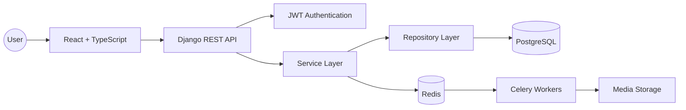
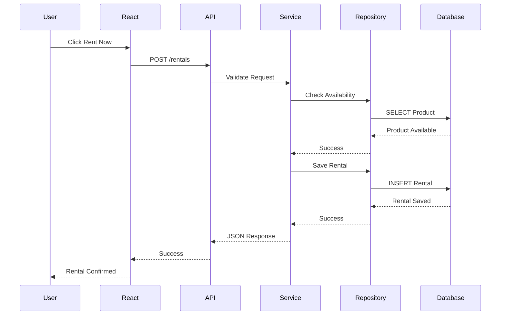
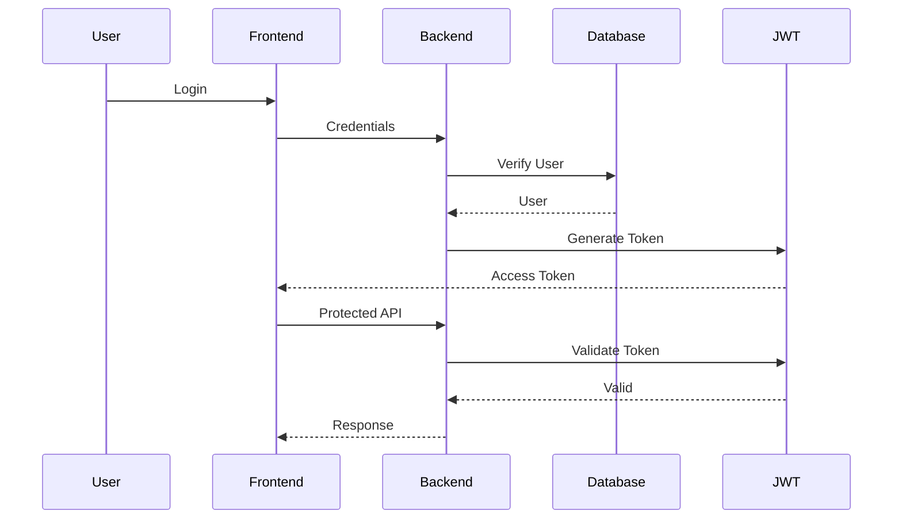
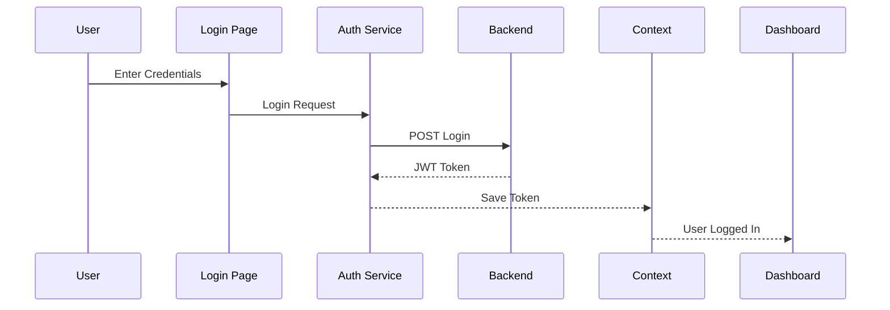
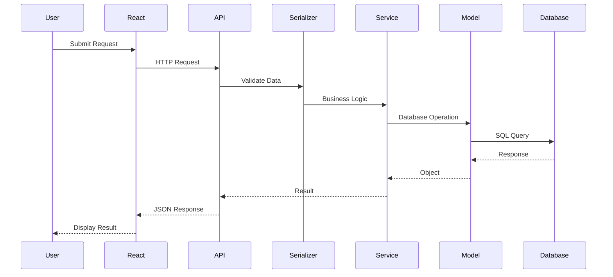
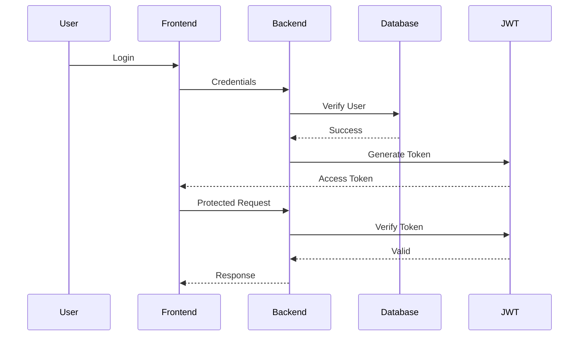
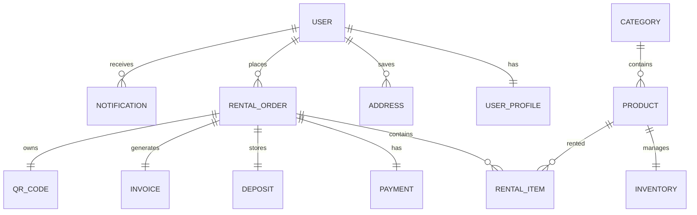

# 📖 Overview

---

# 🏠 Rental Hub

### *Smart Enterprise Rental Management System*

> **Rent Smarter • Manage Better •Grow Faster**

Rental Hub is a modern Enterprise Rental Management System (RMS) developed to digitize and automate the complete rental lifecycle. Instead of relying on spreadsheets, paperwork, phone calls, and manual processes, Rental Hub provides a centralized platform where businesses can efficiently manage products, customers, rental orders, invoices, security deposits, QR verification, inventory, and business analytics.

The platform is built using modern full-stack technologies including **React, TypeScript, Django REST Framework, PostgreSQL, Redis, Celery, and Docker**. It follows enterprise software engineering principles to ensure scalability, maintainability, security, and high performance.

Rental Hub is designed for businesses that rent products such as equipment, vehicles, electronics, furniture, cameras, medical devices, tools, event supplies, camping gear, and many other rentable assets.

---

# 🎯 Executive Summary

Rental businesses often struggle with inventory management, customer tracking, rental scheduling, security deposits, invoice generation, and return processing. Most organizations still rely on manual workflows that increase operational costs and reduce customer satisfaction.

Rental Hub solves these challenges by providing an integrated digital platform that automates every stage of the rental process.

From customer registration to final product return, every activity is managed through a centralized dashboard.

The system reduces paperwork, minimizes human errors, improves inventory visibility, and provides real-time business insights.

---

# 🌍 Vision

Our vision is to transform traditional rental businesses into modern digital enterprises by providing a scalable, secure, and intelligent rental management platform.

We aim to:

- Improve operational efficiency
- Reduce manual work
- Increase business productivity
- Enhance customer experience
- Provide real-time inventory tracking
- Enable workflow automation
- Support data-driven decision making
- Build an enterprise-ready rental ecosystem

---

# 🚀 Mission

Our mission is to simplify rental operations by replacing manual processes with automation.

Rental Hub enables organizations to spend less time managing paperwork and more time growing their business.

We believe every rental business deserves a reliable, scalable, and intelligent management platform.

---

# ❗ Problem Statement

Traditional rental businesses face several operational challenges.

Some of the most common problems include:

- Manual inventory tracking
- Paper-based invoices
- Double booking of products
- Poor inventory visibility
- Delayed return processing
- Security deposit mismanagement
- Manual late fee calculation
- Scattered customer information
- High operational costs
- Time-consuming workflows
- Human errors
- Lack of business insights

These issues reduce operational efficiency and negatively affect customer satisfaction.

---

# 💡 Proposed Solution

Rental Hub provides one centralized platform for managing the complete rental lifecycle.

The platform allows organizations to:

- Manage rental inventory
- Register customers
- Process rental orders
- Schedule pickups
- Track returns
- Generate invoices
- Manage security deposits
- Calculate late fees automatically
- Generate QR Codes
- Verify rentals using QR scanning
- Monitor dashboards
- Generate reports

By integrating all business operations into one application, Rental Hub significantly reduces manual work while improving productivity.

---

# 🎯 Project Objectives

The primary objectives of Rental Hub are:

## Business Objectives

- Improve operational efficiency
- Reduce paperwork
- Increase profitability
- Improve customer satisfaction
- Reduce administrative work
- Optimize inventory utilization

## Technical Objectives

- Build a scalable web application
- Follow clean architecture
- Implement REST APIs
- Maintain modular code structure
- Ensure application security
- Enable future scalability

## User Objectives

- Easy rental booking
- Transparent pricing
- Faster pickup process
- Simplified return workflow
- Real-time rental tracking
- Quick invoice generation

---

# 👥 Target Users

Rental Hub serves multiple types of users.

## Business Owners

Responsible for:

- Business monitoring
- Revenue tracking
- Analytics
- Inventory management
- Employee management

---

## Managers

Responsible for:

- Rental approval
- Pickup scheduling
- Return management
- Inventory supervision

---

## Employees

Responsible for:

- Product handover
- QR verification
- Return inspection
- Damage reporting

---

## Customers

Responsible for:

- Registration
- Product browsing
- Rental booking
- Order tracking
- Invoice viewing
- Product return

---

# 🏢 Industries Supported

Rental Hub can be adapted for:

- Vehicle Rentals
- Bike Rentals
- Camera Rentals
- Furniture Rentals
- Laptop Rentals
- Medical Equipment Rentals
- Construction Equipment Rentals
- Event Equipment Rentals
- Camping Gear Rentals
- Tool Rentals
- Audio Equipment Rentals
- Sports Equipment Rentals

---

# 🌟 Core Value Proposition

Rental Hub provides:

- Centralized management
- Live inventory tracking
- QR-based verification
- Automated billing
- Security deposit management
- Business analytics
- Secure authentication
- Enterprise architecture

The platform replaces multiple disconnected systems with one intelligent application.

---

# 📈 Business Benefits

Rental Hub helps businesses achieve:

- Increased productivity
- Reduced operational costs
- Better inventory utilization
- Faster rental processing
- Reduced human errors
- Better customer experience
- Improved profitability
- Data-driven decision making

---

# 🔄 Rental Lifecycle

The complete rental lifecycle consists of:

1. Product Listing
2. Customer Registration
3. Rental Booking
4. Rental Approval
5. Invoice Generation
6. Pickup Scheduling
7. QR Verification
8. Rental Period
9. Product Return
10. Inspection
11. Deposit Settlement
12. Rental Completion

---

# 🎓 Learning Outcomes

This project demonstrates practical implementation of:

- React
- TypeScript
- Django
- Django REST Framework
- PostgreSQL
- Docker
- JWT Authentication
- Enterprise Architecture
- REST APIs
- Inventory Management
- QR Code Integration
- Business Workflow Automation

---

# 📌 Project Scope

## Included

- Authentication
- Customer Management
- Inventory Management
- Rental Orders
- Shopping Cart
- Pickup Management
- Return Management
- QR Verification
- Invoice Generation
- Security Deposits
- Analytics Dashboard
- Docker Deployment

## Future Scope

- Online Payments
- AI Forecasting
- Mobile Applications
- IoT Tracking
- Odoo Integration
- Multi-Tenant Support
- Cloud Deployment
- Multi-Branch Management

---

# ✅ Conclusion

Rental Hub is much more than a simple CRUD application. It is a complete enterprise rental management platform designed to automate business operations while providing scalability, security, and excellent user experience.

Its modular architecture allows future expansion into AI-powered analytics, cloud deployment, ERP integration, and enterprise-level business automation.

This document provides a high-level understanding of the project and acts as the foundation for all remaining project documentation.

# ✨ Features

---

# 📌 Introduction

Rental Hub is designed as a complete Rental Management System (RMS) that automates every stage of the rental lifecycle. Instead of focusing on a single feature like inventory or billing, the platform integrates multiple business modules into one centralized application.

Each module is independent, scalable, and connected with the overall workflow to provide a seamless experience for customers, employees, managers, and administrators.

This document explains every major feature of Rental Hub.

---

# 🏗 Core Modules

Rental Hub consists of the following modules:

- Authentication
- User Management
- Customer Management
- Product Management
- Inventory Management
- Rental Management
- Shopping Cart
- Pickup Management
- Return Management
- QR Code Management
- Security Deposit Management
- Invoice & Billing
- Analytics Dashboard
- Notifications
- Reports
- Administration

---

# 🔐 Authentication Module

## Overview

The Authentication Module ensures that only authorized users can access the system.

It provides secure login, registration, and role-based authorization using JWT Authentication.

---

## Features

- User Registration
- Secure Login
- Logout
- JWT Authentication
- Refresh Token
- Password Encryption
- Forgot Password
- Change Password
- Email Verification
- Role-Based Access Control (RBAC)

---

## Benefits

- Secure access
- Protected APIs
- Better user management
- Enterprise-level security

---

# 👥 Customer Management

## Overview

This module stores and manages customer information.

Every rental order is associated with a customer profile.

---

## Features

- Customer Registration
- Customer Profile
- Contact Information
- Address Management
- Rental History
- Active Rentals
- Previous Orders
- Customer Search
- Customer Status

---

## Customer Information

The system stores:

- Full Name
- Email
- Mobile Number
- Address
- Identity Proof
- Rental History
- Current Rentals

---

## Benefits

- Organized customer records
- Faster bookings
- Better customer service
- Easy tracking

---

# 📦 Product Management

## Overview

The Product Module manages all rentable products available in the business.

Products can belong to different categories and have multiple pricing options.

---

## Features

- Add Product
- Edit Product
- Delete Product
- Product Images
- Categories
- Product Description
- Rental Price
- Deposit Amount
- Availability Status
- Product Search

---

## Product Information

Each product contains:

- Product Name
- SKU
- Category
- Description
- Images
- Rental Price
- Security Deposit
- Available Quantity
- Product Status

---

## Benefits

- Easy inventory organization
- Better visibility
- Faster product management

---

# 📦 Inventory Management

## Overview

Inventory Management keeps track of all rentable products.

It ensures products are available before confirming rentals.

---

## Features

- Live Stock Tracking
- Product Availability
- Reserved Products
- Out of Stock Detection
- Inventory Updates
- Stock Reports
- Category Filtering
- Product Search

---

## Benefits

- Prevents double booking
- Better stock visibility
- Improved inventory utilization

---

# 🛒 Rental Management

## Overview

This module manages the complete rental lifecycle.

Every rental passes through predefined stages.

---

## Rental Workflow

1. Browse Products
2. Add to Cart
3. Checkout
4. Rental Confirmation
5. Pickup
6. Rental Active
7. Return
8. Inspection
9. Deposit Settlement
10. Rental Completed

---

## Features

- Rental Booking
- Rental Approval
- Rental Status
- Rental History
- Rental Extension
- Rental Cancellation
- Rental Tracking

---

## Rental Status

- Pending
- Approved
- Ready for Pickup
- Active
- Overdue
- Returned
- Completed
- Cancelled

---

# 🛍 Shopping Cart

## Overview

Customers can rent multiple products using a shopping cart.

---

## Features

- Add Products
- Remove Products
- Quantity Management
- Rental Duration Selection
- Price Calculation
- Deposit Calculation
- Checkout

---

## Benefits

- Easy booking
- Better customer experience
- Faster checkout

---

# 🚚 Pickup Management

## Overview

The Pickup Module manages product handover.

Employees verify rental details before giving products to customers.

---

## Features

- Pickup Scheduling
- Pickup Confirmation
- Employee Assignment
- QR Verification
- Pickup Checklist
- Rental Activation

---

## Benefits

- Organized pickups
- Faster operations
- Reduced mistakes

---

# 📥 Return Management

## Overview

This module manages product returns.

Employees inspect products before completing the rental.

---

## Features

- Return Scheduling
- Return Confirmation
- Product Inspection
- Damage Reporting
- Missing Accessories
- Rental Completion

---

## Inspection Checklist

- Product Condition
- Physical Damage
- Missing Parts
- Accessories Returned
- Cleaning Required

---

# 📱 QR Code Management

## Overview

Rental Hub generates a unique QR Code for every rental order.

The QR Code simplifies pickup and return verification.

---

## Features

- QR Generation
- QR Storage
- QR Download
- QR Verification
- QR Scan History
- QR Validation

---

## Workflow

Rental Created

↓

Generate QR

↓

Store QR

↓

Customer Receives QR

↓

Pickup Scan

↓

Return Scan

↓

Rental Completed

---

## Benefits

- Faster verification
- Reduced paperwork
- Improved accuracy

---

# 💰 Security Deposit Management

## Overview

Security deposits protect businesses from damages and late returns.

Rental Hub manages the complete deposit lifecycle.

---

## Features

- Deposit Collection
- Deposit Tracking
- Deposit Refund
- Partial Refund
- Deposit History
- Automatic Deduction

---

## Deposit Workflow

Collect Deposit

↓

Hold Deposit

↓

Product Return

↓

Inspection

↓

Damage Check

↓

Refund Remaining Amount

---

## Benefits

- Transparent refunds
- Reduced disputes
- Automated deductions

---

# ⏰ Late Fee Management

## Overview

The system automatically calculates penalties for overdue rentals.

---

## Features

- Automatic Detection
- Hourly Charges
- Daily Charges
- Weekly Charges
- Monthly Charges
- Grace Period
- Configurable Rules

---

## Workflow

Rental Return

↓

Compare Time

↓

Late?

↓

Calculate Charges

↓

Generate Invoice

↓

Deduct Deposit

---

## Benefits

- Eliminates manual calculations
- Fair billing
- Faster processing

---

# 🧾 Invoice & Billing

## Overview

Invoices are generated automatically after successful bookings.

---

## Features

- Invoice Generation
- Rental Receipt
- Deposit Receipt
- Refund Receipt
- PDF Download
- Invoice History

---

## Invoice Includes

- Invoice Number
- Customer Information
- Product Details
- Rental Charges
- Deposit
- Taxes
- Late Fee
- Total Amount

---

## Benefits

- Professional invoices
- Accurate billing
- Easy record keeping

---

# 📊 Analytics Dashboard

## Overview

The dashboard provides real-time insights into business performance.

---

## Dashboard Widgets

- Active Rentals
- Today's Pickups
- Today's Returns
- Overdue Rentals
- Revenue
- Customers
- Inventory
- Popular Products
- Rental Trends
- Monthly Reports

---

## Benefits

- Better decision making
- Performance monitoring
- Business intelligence

---

# 🔔 Notifications

## Features

- Booking Confirmation
- Pickup Reminder
- Return Reminder
- Payment Reminder
- Late Return Alert
- Deposit Refund Notification

---

## Notification Channels

- Email
- Dashboard Alerts
- Future SMS Support

---

# 📈 Reports

Rental Hub provides various reports.

## Available Reports

- Rental Report
- Revenue Report
- Inventory Report
- Customer Report
- Deposit Report
- Late Fee Report
- Product Utilization Report

---

# ⚙ Administration

Administrators have complete control over the platform.

---

## Admin Features

- Manage Users
- Manage Products
- Manage Inventory
- Manage Rentals
- Configure Pricing
- Manage Roles
- View Reports
- Dashboard Monitoring

---

# 🔒 Security Features

Rental Hub includes enterprise-level security.

- JWT Authentication
- Password Hashing
- Role-Based Access
- Protected APIs
- Input Validation
- Secure Sessions
- Audit Logs

---

# 🌟 Feature Highlights

| Module | Key Feature |
|---------|-------------|
| Authentication | JWT Security |
| Customers | Rental History |
| Products | Category Management |
| Inventory | Live Stock Tracking |
| Rentals | End-to-End Workflow |
| Pickup | QR Verification |
| Return | Product Inspection |
| Deposits | Automatic Refund |
| Billing | PDF Invoice |
| Dashboard | Live Analytics |
| Reports | Business Insights |
| Notifications | Email Alerts |

---

# 🚀 Future Features

The following enhancements are planned for future releases:

- Online Payment Gateway
- Mobile Application
- AI Rental Demand Prediction
- AI Pricing Recommendation
- Multi-Branch Support
- Multi-Tenant Architecture
- IoT Asset Tracking
- Predictive Maintenance
- Odoo ERP Integration
- Cloud Deployment
- Multi-Language Support
- Customer Loyalty Program

---

# ✅ Summary

Rental Hub combines inventory management, customer management, rental workflows, QR verification, billing, security deposits, analytics, and reporting into a single enterprise platform.

Each module is designed independently while seamlessly integrating with the complete rental lifecycle. This modular architecture makes the system scalable, maintainable, and ready for future enterprise enhancements.

# 🏗️ System Architecture

---

# 📖 Introduction

Rental Hub follows a modern **Enterprise Layered Architecture**, where each layer has a specific responsibility. This design ensures that the application remains scalable, maintainable, secure, and easy to extend as new features are introduced.

Instead of tightly coupling the frontend, backend, and database, Rental Hub separates business logic, data access, presentation, and infrastructure into independent layers. This separation improves code quality, testing, debugging, and future scalability.

---

# 🎯 Architecture Goals

The architecture is designed to achieve the following goals:

- Scalability
- Maintainability
- Security
- Performance
- Reusability
- Separation of Concerns
- Clean Code
- Easy Testing
- Easy Deployment
- Enterprise Readiness

---

# 🏢 High-Level Architecture



---

# 📌 Architecture Overview

The system is divided into five primary layers.

1. Presentation Layer
2. API Layer
3. Business Layer
4. Data Access Layer
5. Database Layer

Each layer communicates only with its immediate neighboring layer.

This architecture reduces dependencies and keeps the application organized.

---

# 🏗️ Layered Architecture

```text
+--------------------------------------+
|          Presentation Layer          |
|      React + TypeScript UI           |
+--------------------------------------+
                 │
                 ▼
+--------------------------------------+
|            API Layer                 |
|     Django REST Framework            |
+--------------------------------------+
                 │
                 ▼
+--------------------------------------+
|         Business Logic Layer         |
|          Service Classes             |
+--------------------------------------+
                 │
                 ▼
+--------------------------------------+
|        Repository Layer              |
|      Database Operations             |
+--------------------------------------+
                 │
                 ▼
+--------------------------------------+
|          PostgreSQL Database         |
+--------------------------------------+
```

---

# 🎨 Presentation Layer

## Purpose

The Presentation Layer is responsible for displaying information to users and collecting user input.

It contains all frontend components.

---

## Technologies

- React
- TypeScript
- Tailwind CSS
- Context API
- Axios
- React Router

---

## Responsibilities

- Display pages
- User interaction
- Form validation
- API communication
- State management
- Routing

---

# 🔗 API Layer

## Purpose

Acts as the communication bridge between the frontend and backend.

All frontend requests pass through this layer.

---

## Responsibilities

- Receive HTTP requests
- Validate requests
- Authenticate users
- Return JSON responses
- Route requests

---

## Technologies

- Django
- Django REST Framework

---

# ⚙ Business Logic Layer

The Service Layer contains the actual business rules.

Instead of placing business logic inside views, every operation is delegated to services.

Example:

```
Create Rental

↓

Check Product Availability

↓

Calculate Deposit

↓

Generate Invoice

↓

Generate QR

↓

Save Rental
```

---

## Responsibilities

- Rental calculations
- Deposit calculations
- Pricing rules
- Invoice generation
- QR generation
- Validation

---

# 🗄 Repository Layer

The Repository Layer communicates directly with the database.

Instead of allowing services to access models directly, repositories isolate database operations.

---

## Responsibilities

- Create records
- Read records
- Update records
- Delete records
- Filtering
- Searching

---

## Benefits

- Clean code
- Easy testing
- Database independence
- Reusable queries

---

# 💾 Database Layer

Rental Hub uses PostgreSQL.

The database stores:

- Users
- Customers
- Products
- Rentals
- Orders
- Deposits
- Payments
- QR Codes
- Invoices

---

# 🔄 Complete Request Flow



---

# 🔐 Authentication Architecture

Rental Hub uses JWT Authentication.



---

# 👥 User Roles

The platform supports Role-Based Access Control.

## Admin

- Full system access
- Dashboard
- Inventory
- Reports
- User management
- Settings

---

## Manager

- Rental approval
- Inventory monitoring
- Pickup scheduling
- Return approval

---

## Employee

- Pickup
- QR Scan
- Return inspection

---

## Customer

- Browse products
- Place orders
- View rentals
- Download invoices

---

# 📂 Frontend Architecture

```
src/

├── api/
├── assets/
├── components/
├── context/
├── hooks/
├── layouts/
├── pages/
├── routes/
├── services/
├── styles/
├── types/
└── utils/
```

---

# ⚙ Backend Architecture

```
backend/

├── accounts/
├── inventory/
├── rentals/
├── payments/
├── dashboard/
├── reports/
├── media/
├── static/
└── manage.py
```

---

# 🧩 Design Patterns Used

Rental Hub follows several enterprise design patterns.

## Repository Pattern

Separates database operations from business logic.

---

## Service Layer Pattern

Separates business rules from controllers.

---

## Factory Pattern

Used for:

- Invoice Generation
- QR Generation
- PDF Generation

---

## Context Pattern

Used in React for:

- Authentication
- Shopping Cart
- Theme

---

## Modular Architecture

Each Django application works independently.

Modules include:

- Accounts
- Inventory
- Rentals
- Payments
- Dashboard

---

# 🔄 Data Flow

```mermaid
flowchart LR

Customer

↓

Frontend

↓

REST API

↓

Service Layer

↓

Repository

↓

Database

↓

Repository

↓

Service Layer

↓

REST API

↓

Frontend

↓

Customer
```

---

# ⚡ Background Processing

Heavy operations are executed using Celery.

Examples:

- Email Sending
- Invoice Generation
- QR Generation
- Notifications
- Scheduled Tasks

Benefits:

- Faster response
- Better performance
- Improved user experience

---

# 📦 Caching

Redis is used for:

- API caching
- Session caching
- Celery Queue
- Frequently accessed data

Benefits:

- Faster API response
- Reduced database load

---

# 📄 File Storage

Rental Hub stores:

- Product Images
- QR Codes
- PDF Invoices
- Documents

Future support:

- AWS S3
- Azure Blob Storage
- Google Cloud Storage

---

# 🌐 Deployment Architecture

```mermaid
flowchart LR

Internet

↓

Nginx

↓

React Frontend

↓

Gunicorn

↓

Django REST API

↓

PostgreSQL

Redis

Celery
```

---

# 📈 Scalability

The architecture supports future enterprise expansion.

Possible upgrades:

- Kubernetes
- Load Balancer
- Microservices
- Multi-Tenant Architecture
- CDN
- Cloud Storage
- AI Services

---

# 🔒 Security Architecture

Implemented security measures include:

- JWT Authentication
- HTTPS Ready
- Password Hashing
- Role-Based Access Control
- Input Validation
- Secure API Endpoints
- Audit Logging
- Environment Variables
- Protected Routes

---

# 🎯 Advantages of this Architecture

- Easy Maintenance
- Clean Code
- Faster Development
- Better Testing
- High Scalability
- Better Security
- Modular Design
- Enterprise Ready
- Cloud Ready
- Docker Friendly

---

# 📚 Summary

Rental Hub follows a modern layered enterprise architecture that separates presentation, API communication, business logic, data access, and storage into independent modules.

This approach improves maintainability, security, scalability, and code quality while making the system easier to test, deploy, and extend.

The architecture is designed not only for the current hackathon MVP but also for future enterprise features such as AI-powered analytics, cloud deployment, payment gateway integration, and multi-tenant support.

# 🎨 Frontend Architecture

---

# 📖 Introduction

The frontend of **Rental Hub** is designed to provide a fast, responsive, and user-friendly experience for all users, including administrators, managers, employees, and customers.

The application is developed using **React** and **TypeScript**, following a modular component-based architecture. Each page is built using reusable UI components to reduce duplication, improve maintainability, and simplify future development.

The frontend communicates with the backend exclusively through REST APIs provided by Django REST Framework.

---

# 🎯 Frontend Goals

The frontend architecture is designed to achieve the following objectives:

- Responsive User Interface
- Fast Performance
- Reusable Components
- Easy Maintenance
- Clean Folder Structure
- Type Safety
- Scalability
- Better User Experience
- Secure API Communication
- Enterprise-Level Design

---

# 🏗 High-Level Frontend Architecture

```mermaid
flowchart TD

User

↓

Pages

↓

Components

↓

Hooks

↓

Services

↓

REST API

↓

Backend
```

The frontend follows a layered approach where every UI action ultimately communicates with the backend through service functions.

---

# ⚙ Technology Stack

| Layer | Technology |
|---------|------------|
| Framework | React |
| Language | TypeScript |
| Styling | Tailwind CSS |
| Routing | React Router DOM |
| HTTP Client | Axios |
| State Management | Context API |
| Icons | Lucide React |
| Forms | React Hook Form |
| Validation | Zod |
| Charts | Recharts |
| Build Tool | Vite |

---

# 📁 Frontend Folder Structure

```
frontend/

└── src/

    ├── api/
    ├── assets/
    ├── components/
    ├── context/
    ├── hooks/
    ├── layouts/
    ├── pages/
    ├── routes/
    ├── services/
    ├── styles/
    ├── types/
    ├── utils/
    ├── App.tsx
    └── main.tsx
```

---

# 📂 Folder Explanation

## api/

Contains API configuration.

Example:

- Axios Instance
- Base URL
- Token Configuration
- Interceptors

---

## assets/

Stores static resources.

Examples:

- Images
- Logos
- Icons
- Fonts

---

## components/

Contains reusable UI components.

Examples:

- Navbar
- Sidebar
- Footer
- Product Card
- Customer Card
- QR Scanner
- Buttons
- Forms
- Tables
- Cards
- Modals

---

## context/

Stores global state.

Examples:

- Authentication
- User
- Cart
- Theme

---

## hooks/

Contains reusable custom hooks.

Examples:

- useAuth()
- useProducts()
- useCart()
- useInventory()
- useDashboard()

---

## layouts/

Defines page layouts.

Examples:

- Admin Layout
- Customer Layout
- Dashboard Layout
- Authentication Layout

---

## pages/

Contains complete pages.

Examples:

- Login
- Register
- Dashboard
- Inventory
- Customers
- Rentals
- Reports
- Analytics
- Settings

---

## routes/

Defines application routing.

Example

```
/

/login

/dashboard

/products

/customers

/rentals

/orders

/reports
```

---

## services/

Contains API communication.

Examples:

- authService
- productService
- customerService
- rentalService
- reportService

---

## utils/

Contains helper functions.

Examples:

- Currency Formatter
- Date Formatter
- Validators
- QR Generator
- Price Calculator

---

## types/

Contains TypeScript interfaces.

Examples:

- Product
- Customer
- Rental
- User
- Invoice

---

# 🧩 Component Architecture

Rental Hub follows reusable component architecture.

```mermaid
flowchart TD

Page

↓

Section

↓

Card

↓

Button

↓

Icon
```

Every page is composed of reusable components.

This minimizes duplicated code.

---

# 📦 Common Components

The following reusable components are used throughout the application.

## Navigation

- Navbar
- Sidebar
- Breadcrumb

---

## Forms

- Input
- Select
- Checkbox
- Date Picker
- File Upload

---

## Cards

- Product Card
- Customer Card
- Analytics Card
- Dashboard Card

---

## Tables

- Product Table
- Rental Table
- Customer Table
- Invoice Table

---

## Dialogs

- Confirmation Dialog
- Delete Dialog
- Edit Dialog
- Success Dialog

---

## Buttons

- Primary Button
- Secondary Button
- Danger Button
- Icon Button

---

# 🎨 UI Design Principles

Rental Hub follows modern UI principles.

- Minimal Design
- Responsive Layout
- Consistent Colors
- Accessibility
- High Readability
- Smooth Navigation
- Component Reusability

---

# 📱 Responsive Design

The application supports:

- Desktop
- Laptop
- Tablet
- Mobile

Responsive breakpoints ensure that users have an optimal experience on all devices.

---

# 🎯 Page Hierarchy

```mermaid
flowchart TD

App

↓

Layout

↓

Page

↓

Section

↓

Component

↓

Element
```

---

# 🔄 Routing Flow

```mermaid
flowchart LR

Login

↓

Dashboard

↓

Inventory

↓

Rental

↓

Checkout

↓

Invoice
```

React Router manages all application navigation.

---

# 🔐 Authentication Flow



---

# 🌐 API Communication

Every page communicates through Service classes.

```
Page

↓

Service

↓

Axios

↓

REST API

↓

Backend
```

Benefits:

- Reusable API functions
- Easy maintenance
- Better error handling

---

# 📦 State Management

Rental Hub uses Context API for global state.

Global states include:

- Logged-in User
- Authentication
- Shopping Cart
- Theme
- Notifications

Benefits:

- No prop drilling
- Better organization
- Centralized data

---

# 🔄 Data Flow

```mermaid
flowchart LR

User

↓

Component

↓

Hook

↓

Service

↓

Axios

↓

REST API

↓

Backend

↓

Database
```

---

# 🛡 Error Handling

Frontend handles different error types.

Examples:

- Validation Errors
- Authentication Errors
- Network Errors
- Server Errors
- Permission Errors

Each error displays a meaningful message to the user.

---

# 📊 Dashboard Architecture

The dashboard is composed of multiple reusable widgets.

Examples:

- Revenue Card
- Active Rentals
- Inventory Status
- Monthly Revenue
- Popular Products
- Recent Orders

Each widget fetches its own data independently.

---

# 🖼 Image Handling

Rental Hub supports:

- Product Images
- User Profile Images
- QR Images
- Company Logo

Images are optimized before rendering.

---

# 📋 Form Validation

Forms validate user input before submitting.

Validation includes:

- Required Fields
- Email Format
- Mobile Number
- Price Validation
- Date Validation
- Password Strength

This improves data quality.

---

# 🚀 Performance Optimization

Several optimization techniques are used.

- Lazy Loading
- Code Splitting
- Memoization
- Image Optimization
- Pagination
- Debounced Search

Benefits:

- Faster loading
- Reduced memory usage
- Better user experience

---

# 🎯 Accessibility

Rental Hub follows accessibility guidelines.

Features include:

- Keyboard Navigation
- Proper Labels
- Semantic HTML
- Contrast-Friendly Colors
- Screen Reader Support

---

# 🔒 Frontend Security

Implemented security features:

- Protected Routes
- JWT Storage
- Token Expiry Handling
- Secure API Requests
- Input Validation
- XSS Prevention
- CSRF Protection (Backend)

---

# 📈 Future Improvements

Future frontend enhancements include:

- Progressive Web App (PWA)
- Offline Mode
- Dark Mode
- Multi-Language Support
- Push Notifications
- Voice Search
- Mobile Application

---

# ✅ Summary

The Rental Hub frontend is built using a modern React and TypeScript architecture focused on modularity, scalability, and maintainability. Reusable components, centralized state management, clean routing, secure API communication, and responsive design ensure that the application provides a seamless experience for all users.

The architecture is flexible enough to support future enterprise features while remaining simple for developers to maintain and extend.

# ⚙️ Backend Architecture

---

# 📖 Introduction

The backend is the core of Rental Hub. It is responsible for processing business logic, validating user requests, managing rental operations, communicating with the database, generating invoices, creating QR codes, handling authentication, and serving REST APIs to the frontend.

Rental Hub uses **Django** and **Django REST Framework (DRF)** to build a secure, scalable, and modular backend. Every feature is organized into separate Django applications, making the codebase clean, maintainable, and easy to extend.

The backend follows enterprise software engineering principles such as layered architecture, modular development, reusable services, and secure API design.

---

# 🎯 Backend Goals

The backend is designed to achieve the following objectives:

- Modular Development
- Secure REST APIs
- High Performance
- Business Logic Separation
- Easy Maintenance
- Scalability
- Reliable Data Management
- Enterprise Security
- Future Expansion

---

# 🏗 Backend Architecture

```mermaid
flowchart TD

Client["React Frontend"]

↓

Router["Django URL Router"]

↓

View["APIView / ViewSet"]

↓

Serializer["Serializer"]

↓

Service["Business Service"]

↓

Repository["Database Queries"]

↓

Model["Django Models"]

↓

PostgreSQL[(Database)]
```

Every request passes through these layers before reaching the database.

---

# ⚙ Technology Stack

| Layer | Technology |
|---------|------------|
| Framework | Django |
| API Framework | Django REST Framework |
| Language | Python |
| Authentication | JWT |
| Database | PostgreSQL |
| Queue | Celery |
| Cache | Redis |
| Storage | Media Storage |
| Deployment | Gunicorn + Docker |

---

# 📁 Backend Folder Structure

```
backend/

├── accounts/
├── inventory/
├── rentals/
├── orders/
├── dashboard/
├── reports/
├── payments/
├── qr/
├── notifications/
├── core/
├── media/
├── static/
├── config/
├── manage.py
└── requirements.txt
```

---

# 📂 Folder Description

## accounts/

Responsible for:

- User Registration
- Login
- Authentication
- Authorization
- Roles
- Password Reset

---

## inventory/

Responsible for:

- Products
- Categories
- Stock
- Availability
- Product Images

---

## rentals/

Responsible for:

- Rental Orders
- Rental Status
- Pickup
- Return
- Rental History

---

## orders/

Responsible for:

- Shopping Cart
- Checkout
- Order Creation
- Order Validation

---

## dashboard/

Responsible for:

- Revenue Statistics
- Business Metrics
- Analytics
- KPIs

---

## reports/

Responsible for generating:

- Revenue Report
- Rental Report
- Inventory Report
- Customer Report

---

## payments/

Responsible for:

- Deposits
- Refunds
- Invoice Calculation
- Payment Records

---

## qr/

Responsible for:

- QR Generation
- QR Validation
- QR Verification

---

## notifications/

Responsible for:

- Email Notifications
- Reminder Messages
- Rental Alerts
- Return Alerts

---

## core/

Contains:

- Common Utilities
- Permissions
- Middleware
- Constants
- Helper Functions

---

# 🔄 Request Lifecycle

Every request follows this flow.



---

# 🌐 REST API Design

The backend exposes REST APIs.

Example endpoints:

```
POST    /api/login/

POST    /api/register/

GET     /api/products/

POST    /api/products/

GET     /api/customers/

POST    /api/rentals/

GET     /api/dashboard/

GET     /api/reports/
```

Each endpoint returns JSON responses.

---

# 📦 Models

Every business entity has a dedicated model.

Examples:

- User
- Customer
- Product
- Category
- Rental
- Rental Item
- Invoice
- Deposit
- Payment
- QR Code

Models are connected using Django ORM relationships.

---

# 🔗 Serializers

Serializers convert Django models into JSON and validate incoming data.

Responsibilities:

- Data Validation
- JSON Conversion
- Nested Objects
- Error Handling

Benefits:

- Cleaner APIs
- Secure Validation
- Reduced Boilerplate

---

# 🧠 Business Services

Business logic is separated into service classes.

Examples:

- Rental Service
- Payment Service
- Inventory Service
- QR Service
- Invoice Service

Example flow:

```
Create Rental

↓

Check Stock

↓

Calculate Deposit

↓

Generate Invoice

↓

Generate QR

↓

Save Rental
```

---

# 🗄 Database Layer

The backend communicates with PostgreSQL using Django ORM.

Operations include:

- Create
- Read
- Update
- Delete
- Filtering
- Aggregation
- Pagination

---

# 🔐 Authentication

Rental Hub uses JWT Authentication.

Authentication Flow:



---

# 👥 Authorization

The backend implements Role-Based Access Control.

Available roles:

- Administrator
- Manager
- Employee
- Customer

Permissions determine which APIs each role can access.

---

# 📦 Inventory Logic

Before confirming any rental:

1. Check Product Availability
2. Verify Stock
3. Reserve Quantity
4. Create Rental
5. Update Inventory

This prevents double booking.

---

# 💰 Deposit Logic

The backend automatically manages security deposits.

Workflow:

```
Rental Created

↓

Collect Deposit

↓

Hold Deposit

↓

Product Returned

↓

Inspection

↓

Refund Remaining Deposit
```

---

# 📱 QR Code Logic

Every rental receives a unique QR code.

Workflow:

```
Rental Created

↓

Generate QR

↓

Store QR

↓

Customer Receives QR

↓

Pickup Scan

↓

Return Scan
```

---

# 🧾 Invoice Logic

Invoice Generation Process:

```
Rental Created

↓

Calculate Rental Charges

↓

Calculate Deposit

↓

Calculate Tax

↓

Generate Invoice

↓

Store PDF
```

Invoices can later be downloaded by customers.

---

# 🔔 Notification Service

Automatic notifications include:

- Booking Confirmation
- Pickup Reminder
- Return Reminder
- Late Return Alert
- Deposit Refund Notification

Future support:

- SMS
- WhatsApp
- Push Notifications

---

# 📊 Analytics Engine

Dashboard statistics include:

- Active Rentals
- Revenue
- Customers
- Product Utilization
- Monthly Orders
- Overdue Rentals

These values are calculated using database aggregation queries.

---

# ⚡ Background Tasks

Celery handles long-running tasks.

Examples:

- Email Sending
- Invoice Generation
- QR Generation
- Scheduled Reports
- Notifications

Benefits:

- Faster API Response
- Better Performance
- Improved User Experience

---

# 🚀 Performance Optimization

The backend uses several optimization techniques:

- Query Optimization
- Pagination
- Lazy Loading
- Redis Caching
- Bulk Operations
- Database Indexing

Benefits:

- Faster APIs
- Lower Server Load
- Better Scalability

---

# 🛡 Security Features

Implemented security measures:

- JWT Authentication
- Password Hashing
- Protected APIs
- Input Validation
- SQL Injection Protection
- XSS Protection
- CSRF Protection
- Rate Limiting (Future)
- Audit Logging

---

# ❌ Error Handling

The backend returns standardized error responses.

Examples:

- 400 Bad Request
- 401 Unauthorized
- 403 Forbidden
- 404 Not Found
- 409 Conflict
- 500 Internal Server Error

Consistent error messages improve frontend integration.

---

# 🧪 Testing Strategy

Backend testing includes:

- Unit Testing
- API Testing
- Integration Testing
- Authentication Testing
- Database Testing

Future:

- Performance Testing
- Load Testing
- Security Testing

---

# 🌍 Future Enhancements

Planned backend improvements:

- Payment Gateway Integration
- AI Recommendation Engine
- AI Demand Forecasting
- Multi-Tenant Support
- Odoo ERP Integration
- Kubernetes Deployment
- Cloud Storage
- GraphQL APIs
- Microservices Architecture

---

# 📚 Summary

The Rental Hub backend is built on Django and Django REST Framework using a modular, layered architecture. Business logic, API endpoints, database operations, authentication, QR management, billing, and analytics are organized into independent modules that work together seamlessly.

This architecture ensures high security, maintainability, scalability, and performance, making Rental Hub suitable not only for a hackathon MVP but also as a strong foundation for future enterprise-level development.

# 🗄️ Database Design

---

# 📖 Introduction

The database is the backbone of Rental Hub. It stores all the information related to users, customers, products, rental orders, payments, invoices, QR codes, inventory, and business analytics.

Rental Hub uses **PostgreSQL**, a powerful open-source relational database management system (RDBMS), because it offers high performance, reliability, scalability, and strong support for complex relationships.

The database is designed using **normalization principles** to minimize redundancy while ensuring data consistency and integrity.

---

# 🎯 Database Objectives

The database is designed to achieve the following goals:

- Data Consistency
- High Performance
- Data Integrity
- Scalability
- Security
- Easy Maintenance
- Efficient Queries
- Relationship Management
- Transaction Support

---

# 🏗 Database Architecture

```mermaid
flowchart TD

User

↓

Frontend

↓

REST API

↓

Business Logic

↓

PostgreSQL

↓

Database Tables
```

---

# 🛠 Database Technology

| Component | Technology |
|------------|------------|
| Database | PostgreSQL |
| ORM | Django ORM |
| Migration Tool | Django Migrations |
| Query Language | SQL |
| Connection | psycopg2 |

---

# 📊 Database Overview

Rental Hub consists of multiple related tables.

Major entities include:

- Users
- User Profiles
- Customers
- Addresses
- Categories
- Products
- Inventory
- Rental Orders
- Rental Items
- Payments
- Deposits
- Invoices
- QR Codes
- Notifications

---

# 📂 Database Schema

```text
Users
│
├── User Profile
├── Customer
│
Products
│
├── Category
├── Inventory
│
Rental Order
│
├── Rental Item
├── Payment
├── Invoice
├── Deposit
└── QR Code
```

---

# 👤 User Table

Stores authentication information.

## Fields

| Field | Type |
|--------|------|
| id | UUID |
| username | VARCHAR |
| email | VARCHAR |
| password | HASH |
| role | ENUM |
| is_active | BOOLEAN |
| created_at | TIMESTAMP |

---

## Relationships

- One User → One Profile
- One User → Many Rental Orders

---

# 👤 User Profile Table

Stores additional user information.

## Fields

| Field | Type |
|--------|------|
| id | UUID |
| user_id | FK |
| full_name | VARCHAR |
| phone | VARCHAR |
| profile_image | TEXT |
| created_at | TIMESTAMP |

---

# 📍 Address Table

Stores customer addresses.

## Fields

| Field | Type |
|--------|------|
| id | UUID |
| user_id | FK |
| street | TEXT |
| city | VARCHAR |
| state | VARCHAR |
| postal_code | VARCHAR |
| country | VARCHAR |

---

# 🏷 Category Table

Stores product categories.

Examples:

- Camera
- Laptop
- Vehicle
- Furniture
- Tool
- Medical Equipment

## Fields

| Field | Type |
|--------|------|
| id | UUID |
| name | VARCHAR |
| description | TEXT |

---

# 📦 Product Table

Stores rentable products.

## Fields

| Field | Type |
|--------|------|
| id | UUID |
| category_id | FK |
| product_name | VARCHAR |
| sku | VARCHAR |
| description | TEXT |
| rental_price | DECIMAL |
| deposit | DECIMAL |
| status | ENUM |
| image | TEXT |

---

# 📦 Inventory Table

Tracks stock.

## Fields

| Field | Type |
|--------|------|
| id | UUID |
| product_id | FK |
| quantity | INTEGER |
| available | INTEGER |
| reserved | INTEGER |
| damaged | INTEGER |

---

# 🛒 Rental Order Table

Stores rental transactions.

## Fields

| Field | Type |
|--------|------|
| id | UUID |
| customer_id | FK |
| rental_date | DATE |
| return_date | DATE |
| total_amount | DECIMAL |
| deposit | DECIMAL |
| status | ENUM |

---

## Rental Status

- Pending
- Approved
- Ready
- Active
- Returned
- Completed
- Cancelled

---

# 📦 Rental Item Table

Stores products inside a rental order.

## Fields

| Field | Type |
|--------|------|
| id | UUID |
| rental_order_id | FK |
| product_id | FK |
| quantity | INTEGER |
| rental_price | DECIMAL |

---

# 💰 Payment Table

Stores payment information.

## Fields

| Field | Type |
|--------|------|
| id | UUID |
| rental_order_id | FK |
| payment_method | VARCHAR |
| amount | DECIMAL |
| payment_status | ENUM |
| payment_date | DATE |

---

# 💵 Deposit Table

Stores security deposits.

## Fields

| Field | Type |
|--------|------|
| id | UUID |
| rental_order_id | FK |
| deposit_amount | DECIMAL |
| deducted_amount | DECIMAL |
| refunded_amount | DECIMAL |
| status | ENUM |

---

# 🧾 Invoice Table

Stores generated invoices.

## Fields

| Field | Type |
|--------|------|
| id | UUID |
| rental_order_id | FK |
| invoice_number | VARCHAR |
| subtotal | DECIMAL |
| tax | DECIMAL |
| total | DECIMAL |
| pdf_path | TEXT |

---

# 📱 QR Code Table

Stores generated QR codes.

## Fields

| Field | Type |
|--------|------|
| id | UUID |
| rental_order_id | FK |
| qr_value | TEXT |
| qr_image | TEXT |
| generated_at | TIMESTAMP |

---

# 🔔 Notification Table

Stores notifications.

## Fields

| Field | Type |
|--------|------|
| id | UUID |
| user_id | FK |
| title | VARCHAR |
| message | TEXT |
| is_read | BOOLEAN |
| created_at | TIMESTAMP |

---

# 🔗 Entity Relationships



---

# 🔄 Database Workflow

```mermaid
flowchart LR

Customer

↓

Rental Order

↓

Rental Item

↓

Inventory Update

↓

Payment

↓

Invoice

↓

QR Generation

↓

Rental Completion
```

---

# 🔒 Constraints

Database constraints ensure consistency.

Examples:

- Primary Keys
- Foreign Keys
- NOT NULL
- UNIQUE
- CHECK Constraints
- Default Values

---

# 📈 Indexing Strategy

Indexes improve query performance.

Indexed columns include:

- Email
- Username
- Product Name
- SKU
- Rental Status
- Invoice Number
- Payment Status
- QR Value

Benefits:

- Faster Search
- Faster Login
- Faster Reports

---

# 🔄 Normalization

The database follows normalization principles.

- First Normal Form (1NF)
- Second Normal Form (2NF)
- Third Normal Form (3NF)

Advantages:

- Reduced Redundancy
- Better Data Integrity
- Easier Maintenance

---

# 🛡 Data Security

Security measures include:

- Password Hashing
- Foreign Key Constraints
- Role-Based Access
- Transaction Management
- Automatic Backups (Future)
- Audit Logs (Future)

---

# 💾 Backup Strategy

Recommended backup methods:

- Daily Incremental Backup
- Weekly Full Backup
- Monthly Archive
- Cloud Backup (Future)

---

# 🚀 Future Database Enhancements

Future improvements include:

- Multi-Tenant Database
- Database Replication
- Read Replicas
- Partitioning
- Automatic Backup
- Data Warehouse
- AI Analytics Database
- Cloud PostgreSQL

---

# 📚 Summary

The Rental Hub database is designed using PostgreSQL with a normalized relational schema that supports efficient storage, secure transactions, and scalable business operations. It models all key entities—users, products, rentals, payments, invoices, QR codes, and inventory—through well-defined relationships.

The design ensures high performance, data integrity, and flexibility, providing a solid foundation for both the current Rental Hub application and future enterprise-scale enhancements.

# 🔄 Business Workflows

---

# 📖 Introduction

A **Business Workflow** defines the sequence of activities performed to complete a business process. In Rental Hub, every operation—from customer registration to product return—follows a structured workflow to ensure consistency, transparency, and efficiency.

Instead of relying on manual processes, Rental Hub automates these workflows, reducing errors, saving time, and improving customer satisfaction.

This document explains all the major workflows implemented in the system.

---

# 🎯 Objectives

The workflow system aims to:

- Standardize rental operations
- Reduce manual work
- Improve operational efficiency
- Prevent inventory conflicts
- Automate repetitive tasks
- Improve customer experience
- Increase transparency
- Maintain complete rental history

---

# 🏗 Overall Business Workflow

```mermaid
flowchart TD

Customer Registration

↓

Browse Products

↓

Add to Cart

↓

Rental Request

↓

Approval

↓

Payment & Deposit

↓

Generate Invoice

↓

Generate QR Code

↓

Pickup

↓

Rental Active

↓

Return

↓

Inspection

↓

Late Fee Calculation

↓

Deposit Refund

↓

Rental Completed
```

---

# 👤 Workflow 1 – Customer Registration

## Purpose

Allows new customers to create an account before renting products.

---

## Steps

1. Customer opens Registration Page.
2. Enters personal details.
3. Provides email and phone number.
4. Creates password.
5. System validates information.
6. Customer account is created.
7. User logs into the system.

---

## Workflow Diagram

```mermaid
flowchart LR

Open Registration

↓

Enter Details

↓

Validation

↓

Create Account

↓

Login
```

---

## Outcome

- Customer account created
- User profile generated
- Ready to place rental orders

---

# 📦 Workflow 2 – Product Browsing

## Purpose

Allows customers to explore available rental products.

---

## Steps

1. Open product catalog.
2. Browse categories.
3. Search products.
4. Filter products.
5. View product details.
6. Check availability.
7. Add product to cart.

---

## Available Filters

- Category
- Price
- Availability
- Brand
- Rating (Future)

---

## Workflow Diagram

```mermaid
flowchart LR

Home

↓

Categories

↓

Product List

↓

Search

↓

Product Details

↓

Add to Cart
```

---

# 🛒 Workflow 3 – Rental Booking

## Purpose

Allows customers to create a rental request.

---

## Steps

1. Select products.
2. Choose rental dates.
3. Enter quantity.
4. Review pricing.
5. Confirm rental.
6. Submit request.

---

## System Validation

Before accepting the rental:

- Product availability
- Quantity validation
- Date validation
- User authentication

---

## Workflow Diagram

```mermaid
flowchart TD

Select Product

↓

Choose Dates

↓

Calculate Price

↓

Availability Check

↓

Confirm Rental

↓

Create Order
```

---

# 💰 Workflow 4 – Payment & Deposit

## Purpose

Collect rental payment and security deposit.

---

## Steps

1. Calculate rental price.
2. Calculate security deposit.
3. Display order summary.
4. Complete payment.
5. Save payment record.
6. Generate invoice.

---

## Workflow Diagram

```mermaid
flowchart LR

Rental Order

↓

Calculate Charges

↓

Collect Deposit

↓

Payment Success

↓

Invoice Generated
```

---

# 🧾 Workflow 5 – Invoice Generation

## Purpose

Automatically create invoices after successful bookings.

---

## Invoice Includes

- Customer Name
- Product Details
- Rental Duration
- Rental Charges
- Deposit
- Taxes
- Total Amount
- Invoice Number

---

## Workflow

```mermaid
flowchart TD

Rental Created

↓

Calculate Amount

↓

Generate Invoice

↓

Store PDF

↓

Customer Download
```

---

# 📱 Workflow 6 – QR Code Generation

## Purpose

Generate a unique QR code for every rental order.

---

## Steps

1. Rental confirmed.
2. Generate unique Rental ID.
3. Encode Rental ID.
4. Generate QR image.
5. Save QR.
6. Send to customer.

---

## QR Contains

- Rental ID
- Customer ID
- Pickup Details
- Return Details

---

## Workflow Diagram

```mermaid
flowchart LR

Rental

↓

Rental ID

↓

Generate QR

↓

Store QR

↓

Customer Receives QR
```

---

# 🚚 Workflow 7 – Pickup Process

## Purpose

Verify customer before handing over products.

---

## Steps

1. Customer arrives.
2. Employee scans QR.
3. System validates rental.
4. Verify customer identity.
5. Hand over products.
6. Activate rental.

---

## Workflow Diagram

```mermaid
flowchart TD

Customer

↓

Scan QR

↓

Verify Rental

↓

Verify Identity

↓

Pickup Confirmed

↓

Rental Active
```

---

# ⏳ Workflow 8 – Active Rental

During the rental period:

- Product marked unavailable
- Inventory updated
- Dashboard updated
- Return reminder scheduled

---

# 📥 Workflow 9 – Product Return

## Purpose

Receive rented products.

---

## Steps

1. Customer returns product.
2. Scan QR.
3. Open rental.
4. Inspect product.
5. Update inventory.
6. Close rental.

---

## Workflow Diagram

```mermaid
flowchart TD

Return Product

↓

Scan QR

↓

Open Rental

↓

Inspection

↓

Update Inventory

↓

Complete Rental
```

---

# 🔍 Workflow 10 – Product Inspection

Employees inspect returned products.

---

## Checklist

- Physical Damage
- Missing Accessories
- Cleanliness
- Functional Test
- Quantity Check

---

## Inspection Result

Possible outcomes:

- Good Condition
- Minor Damage
- Major Damage
- Missing Parts

---

# ⏰ Workflow 11 – Late Fee Calculation

## Purpose

Automatically calculate overdue charges.

---

## Steps

1. Compare return date.
2. Calculate delay.
3. Apply pricing rule.
4. Generate late fee.
5. Update invoice.

---

## Workflow Diagram

```mermaid
flowchart LR

Expected Return

↓

Actual Return

↓

Late?

↓

Calculate Fee

↓

Update Invoice
```

---

# 💵 Workflow 12 – Deposit Refund

## Purpose

Refund customer security deposit.

---

## Steps

1. Product inspection.
2. Check damages.
3. Deduct charges.
4. Calculate refund.
5. Update records.
6. Refund customer.

---

## Workflow Diagram

```mermaid
flowchart TD

Inspection

↓

Damage?

↓

Deduction

↓

Refund

↓

Rental Closed
```

---

# 📊 Workflow 13 – Dashboard Analytics

Dashboard updates automatically after every business event.

Updated statistics include:

- Active Rentals
- Revenue
- Inventory
- Customers
- Returns
- Pending Pickups
- Late Returns

---

# 📧 Workflow 14 – Notifications

Notifications are automatically generated.

---

## Customer Notifications

- Registration Successful
- Booking Confirmed
- Pickup Reminder
- Return Reminder
- Deposit Refunded

---

## Employee Notifications

- New Rental
- Pickup Assigned
- Return Scheduled

---

## Manager Notifications

- Overdue Rental
- Inventory Alert
- Revenue Summary

---

# ⚙ Workflow 15 – Admin Operations

Administrators can:

- Add Products
- Update Inventory
- Manage Users
- Configure Pricing
- View Reports
- Manage Categories
- Configure System

---

# 🔄 Complete Rental Lifecycle

```mermaid
flowchart TD

Customer Registration

↓

Browse Products

↓

Rental Booking

↓

Approval

↓

Payment

↓

Invoice

↓

QR Generation

↓

Pickup

↓

Rental Active

↓

Return

↓

Inspection

↓

Late Fee

↓

Deposit Refund

↓

Rental Completed
```

---

# 🎯 Workflow Benefits

Rental Hub workflows provide:

- Faster Operations
- Better Customer Experience
- Reduced Manual Work
- Inventory Accuracy
- Secure Transactions
- Transparent Billing
- Automated Notifications
- Better Reporting

---

# 🚀 Future Workflow Enhancements

Future workflow improvements include:

- Online Payment Gateway
- AI-Based Rental Recommendations
- Smart Pricing Engine
- IoT Asset Tracking
- Predictive Maintenance
- Mobile Application
- Digital Agreement Signing
- Customer Loyalty Program

---

# 📚 Summary

Rental Hub implements a complete set of automated business workflows covering customer registration, product browsing, rental booking, payment processing, invoice generation, QR-based pickup and return verification, inventory updates, late fee calculation, deposit refunds, notifications, and analytics.

These workflows ensure consistency, reduce manual effort, improve operational efficiency, and provide a seamless experience for customers and staff. The modular workflow design also allows future integration with AI, ERP systems, online payments, and cloud services.

# 🌐 API Documentation

---

# 📖 Introduction

The Rental Hub backend exposes a set of RESTful APIs that allow the frontend and external applications to interact with the system securely.

The APIs are developed using **Django REST Framework (DRF)** and follow REST principles such as resource-based URLs, standard HTTP methods, proper status codes, JSON responses, and JWT Authentication.

This document explains the API architecture, authentication process, endpoint categories, request/response format, error handling, and future enhancements.

---

# 🎯 API Objectives

The API is designed to:

- Enable communication between frontend and backend
- Provide secure access to resources
- Follow RESTful standards
- Return consistent JSON responses
- Support future mobile applications
- Enable third-party integrations
- Maintain scalability and performance

---

# 🏗 API Architecture

```mermaid
flowchart LR

Frontend

↓

Axios

↓

REST API

↓

Authentication

↓

Business Logic

↓

Database

↓

JSON Response

↓

Frontend
```

---

# ⚙ Technology Stack

| Component | Technology |
|------------|------------|
| Framework | Django REST Framework |
| Language | Python |
| Authentication | JWT |
| Data Format | JSON |
| Database | PostgreSQL |
| Documentation | Swagger (Future) |
| API Testing | Postman |

---

# 🌍 Base URL

```
http://localhost:8000/api/
```

Production

```
https://api.rentalhub.com/api/
```

---

# 🔐 Authentication

Rental Hub uses **JWT Authentication**.

Authentication Flow:

```mermaid
sequenceDiagram

User->>Frontend: Login

Frontend->>Backend: POST /login

Backend->>Database: Verify User

Database-->>Backend: Success

Backend->>Frontend: Access Token

Frontend->>Backend: Protected Request

Backend->>JWT: Verify Token

JWT-->>Backend: Valid

Backend-->>Frontend: JSON Response
```

---

# Authorization Header

```
Authorization: Bearer <access_token>
```

Every protected endpoint requires this header.

---

# 📦 API Categories

Rental Hub APIs are divided into:

- Authentication APIs
- User APIs
- Customer APIs
- Product APIs
- Category APIs
- Inventory APIs
- Rental APIs
- Cart APIs
- Payment APIs
- Deposit APIs
- Invoice APIs
- QR APIs
- Dashboard APIs
- Report APIs
- Notification APIs

---

# 🔑 Authentication APIs

## Register

```
POST /api/auth/register/
```

### Request

```json
{
  "username":"john",
  "email":"john@example.com",
  "password":"Password123"
}
```

### Response

```json
{
  "message":"Registration Successful"
}
```

---

## Login

```
POST /api/auth/login/
```

### Request

```json
{
  "email":"john@example.com",
  "password":"Password123"
}
```

### Response

```json
{
  "access":"JWT_ACCESS_TOKEN",
  "refresh":"JWT_REFRESH_TOKEN"
}
```

---

## Logout

```
POST /api/auth/logout/
```

---

## Refresh Token

```
POST /api/auth/token/refresh/
```

---

# 👤 User APIs

## Get Profile

```
GET /api/users/profile/
```

---

## Update Profile

```
PUT /api/users/profile/
```

---

## Change Password

```
PUT /api/users/change-password/
```

---

# 👥 Customer APIs

## Get Customers

```
GET /api/customers/
```

---

## Get Customer

```
GET /api/customers/{id}/
```

---

## Create Customer

```
POST /api/customers/
```

---

## Update Customer

```
PUT /api/customers/{id}/
```

---

## Delete Customer

```
DELETE /api/customers/{id}/
```

---

# 📦 Product APIs

## Get Products

```
GET /api/products/
```

---

## Product Details

```
GET /api/products/{id}/
```

---

## Create Product

```
POST /api/products/
```

---

## Update Product

```
PUT /api/products/{id}/
```

---

## Delete Product

```
DELETE /api/products/{id}/
```

---

## Search Products

```
GET /api/products/?search=camera
```

---

# 🏷 Category APIs

```
GET /api/categories/

POST /api/categories/

PUT /api/categories/{id}/

DELETE /api/categories/{id}/
```

---

# 📦 Inventory APIs

## Inventory List

```
GET /api/inventory/
```

---

## Update Stock

```
PUT /api/inventory/{id}/
```

---

## Stock Availability

```
GET /api/inventory/check/{product_id}/
```

---

# 🛒 Rental APIs

## Create Rental

```
POST /api/rentals/
```

---

## Rental List

```
GET /api/rentals/
```

---

## Rental Details

```
GET /api/rentals/{id}/
```

---

## Update Rental

```
PUT /api/rentals/{id}/
```

---

## Cancel Rental

```
DELETE /api/rentals/{id}/
```

---

## Extend Rental

```
PUT /api/rentals/{id}/extend/
```

---

# 🛍 Cart APIs

## View Cart

```
GET /api/cart/
```

---

## Add Product

```
POST /api/cart/
```

---

## Remove Product

```
DELETE /api/cart/{id}/
```

---

## Checkout

```
POST /api/cart/checkout/
```

---

# 💰 Payment APIs

## Make Payment

```
POST /api/payments/
```

---

## Payment History

```
GET /api/payments/
```

---

## Payment Details

```
GET /api/payments/{id}/
```

---

# 💵 Deposit APIs

## Collect Deposit

```
POST /api/deposits/
```

---

## Deposit Details

```
GET /api/deposits/{id}/
```

---

## Refund Deposit

```
POST /api/deposits/refund/
```

---

# 🧾 Invoice APIs

## Generate Invoice

```
POST /api/invoices/
```

---

## Invoice List

```
GET /api/invoices/
```

---

## Invoice Details

```
GET /api/invoices/{id}/
```

---

## Download Invoice

```
GET /api/invoices/download/{id}/
```

---

# 📱 QR Code APIs

## Generate QR

```
POST /api/qr/
```

---

## Verify QR

```
POST /api/qr/verify/
```

---

## QR Details

```
GET /api/qr/{id}/
```

---

# 📊 Dashboard APIs

## Dashboard Summary

```
GET /api/dashboard/
```

Returns:

- Revenue
- Active Rentals
- Inventory
- Customers
- Pending Returns

---

## Revenue Analytics

```
GET /api/dashboard/revenue/
```

---

## Inventory Analytics

```
GET /api/dashboard/inventory/
```

---

# 📈 Reports APIs

## Revenue Report

```
GET /api/reports/revenue/
```

---

## Rental Report

```
GET /api/reports/rentals/
```

---

## Customer Report

```
GET /api/reports/customers/
```

---

## Inventory Report

```
GET /api/reports/inventory/
```

---

# 🔔 Notification APIs

## Get Notifications

```
GET /api/notifications/
```

---

## Mark Read

```
PUT /api/notifications/{id}/
```

---

# 📄 Standard Response Format

Successful Response

```json
{
    "success": true,
    "message": "Operation Successful",
    "data": {}
}
```

---

Error Response

```json
{
    "success": false,
    "message": "Validation Failed",
    "errors": {}
}
```

---

# 🚦 HTTP Status Codes

| Code | Meaning |
|------|---------|
| 200 | OK |
| 201 | Created |
| 204 | No Content |
| 400 | Bad Request |
| 401 | Unauthorized |
| 403 | Forbidden |
| 404 | Not Found |
| 409 | Conflict |
| 500 | Internal Server Error |

---

# 🔒 API Security

Implemented security measures:

- JWT Authentication
- Password Hashing
- Role-Based Access Control
- HTTPS Support
- Input Validation
- SQL Injection Protection
- XSS Protection
- Secure Headers

Future:

- API Rate Limiting
- API Keys
- OAuth2
- Two-Factor Authentication

---

# ⚡ API Best Practices

Rental Hub APIs follow these best practices:

- RESTful URL Design
- Stateless Communication
- JSON Responses
- Pagination
- Filtering
- Searching
- Sorting
- Consistent Error Messages
- Versioning Support

---

# 📑 Pagination Example

```
GET /api/products/?page=2&page_size=20
```

---

# 🔍 Filtering Example

```
GET /api/products/?category=laptop
```

---

# 🔎 Searching Example

```
GET /api/products/?search=canon
```

---

# ↕ Sorting Example

```
GET /api/products/?ordering=price
```

Descending

```
GET /api/products/?ordering=-price
```

---

# 🧪 API Testing

Recommended tools:

- Postman
- Insomnia
- Swagger UI
- curl
- Thunder Client

---

# 📈 Future API Enhancements

Future improvements include:

- GraphQL API
- WebSocket Support
- Real-Time Notifications
- Mobile APIs
- AI Recommendation APIs
- Public Developer API
- API Gateway
- Webhooks

---

# 📚 Summary

Rental Hub provides a comprehensive RESTful API that powers all core features of the platform. The APIs are secure, modular, scalable, and designed according to REST principles, making them suitable for web, mobile, and third-party integrations.

With JWT authentication, standardized responses, robust validation, and a well-organized endpoint structure, the API layer serves as a reliable bridge between the frontend and backend while supporting future enterprise-level enhancements.

# 🚀 Installation Guide

---

# 📖 Introduction

This guide explains how to set up and run the **Rental Hub** project on your local machine. It includes all the required software, installation steps, project structure, environment configuration, database setup, Docker support, and troubleshooting tips.

Whether you are a developer, contributor, or evaluator, this guide will help you get the project running quickly.

---

# 🎯 Prerequisites

Before installing Rental Hub, ensure the following software is installed.

| Software | Recommended Version |
|-----------|---------------------|
| Git | Latest Stable |
| Python | 3.11+ |
| Node.js | 20+ |
| npm | 10+ |
| PostgreSQL | 15+ |
| Redis | Latest |
| Docker | Latest |
| Docker Compose | Latest |
| VS Code | Latest |

---

# 💻 Recommended System Requirements

| Component | Minimum | Recommended |
|------------|----------|-------------|
| RAM | 8 GB | 16 GB |
| Storage | 10 GB | 20 GB |
| CPU | Dual Core | Quad Core |
| Operating System | Windows / Linux / macOS | Latest Version |

---

# 📥 Clone Repository

Clone the project using Git.

```bash
git clone https://github.com/your-username/rental-hub.git
```

Move into the project directory.

```bash
cd rental-hub
```

---

# 📂 Project Structure

```
Rental-Hub/

├── backend/
├── frontend/
├── docs/
├── docker/
├── nginx/
├── .env
├── docker-compose.yml
├── README.md
└── requirements.txt
```

---

# ⚙ Backend Setup

Move to backend folder.

```bash
cd backend
```

Create a virtual environment.

### Windows

```bash
python -m venv venv
```

Activate environment.

```bash
venv\Scripts\activate
```

### Linux / macOS

```bash
python3 -m venv venv

source venv/bin/activate
```

---

# 📦 Install Backend Dependencies

```bash
pip install -r requirements.txt
```

Verify installation.

```bash
pip freeze
```

---

# 🗄 PostgreSQL Setup

Create a database.

```sql
CREATE DATABASE rentalhub;
```

Create a database user.

```sql
CREATE USER rentalhub_user
WITH PASSWORD 'password';
```

Grant permissions.

```sql
GRANT ALL PRIVILEGES
ON DATABASE rentalhub
TO rentalhub_user;
```

---

# 🔧 Environment Variables

Create a `.env` file.

Example:

```env
SECRET_KEY=your-secret-key

DEBUG=True

DB_NAME=rentalhub

DB_USER=rentalhub_user

DB_PASSWORD=password

DB_HOST=localhost

DB_PORT=5432

REDIS_URL=redis://localhost:6379

ALLOWED_HOSTS=localhost,127.0.0.1
```

Never commit this file to GitHub.

---

# 🔄 Apply Migrations

```bash
python manage.py makemigrations

python manage.py migrate
```

---

# 👤 Create Superuser

```bash
python manage.py createsuperuser
```

Enter:

- Username
- Email
- Password

---

# ▶ Run Backend

```bash
python manage.py runserver
```

Backend URL

```
http://127.0.0.1:8000
```

---

# 🎨 Frontend Setup

Move to frontend.

```bash
cd frontend
```

Install dependencies.

```bash
npm install
```

Verify packages.

```bash
npm list
```

---

# ▶ Run Frontend

```bash
npm run dev
```

Frontend URL

```
http://localhost:5173
```

---

# 🔗 Backend & Frontend

Ensure frontend points to backend.

Example:

```typescript
const API_URL =
"http://127.0.0.1:8000/api/";
```

---

# 📦 Redis Setup

Start Redis server.

```bash
redis-server
```

Verify.

```bash
redis-cli ping
```

Expected output.

```
PONG
```

---

# ⚡ Celery Setup

Start Celery Worker.

```bash
celery -A config worker -l info
```

Start Celery Beat.

```bash
celery -A config beat -l info
```

---

# 🐳 Docker Installation

Build containers.

```bash
docker-compose build
```

Start containers.

```bash
docker-compose up
```

Detached mode.

```bash
docker-compose up -d
```

Stop containers.

```bash
docker-compose down
```

---

# 📂 Docker Services

The project includes:

- Django
- React
- PostgreSQL
- Redis
- Celery
- Nginx

---

# 🌐 Verify Installation

Open the following URLs.

Frontend

```
http://localhost:5173
```

Backend

```
http://localhost:8000
```

Admin Panel

```
http://localhost:8000/admin
```

API

```
http://localhost:8000/api/
```

---

# 🧪 Running Tests

Backend tests

```bash
python manage.py test
```

Frontend tests

```bash
npm test
```

---

# 📦 Build for Production

Frontend

```bash
npm run build
```

Backend

```bash
python manage.py collectstatic
```

---

# 🔍 Common Commands

Install Python package

```bash
pip install package-name
```

Install npm package

```bash
npm install package-name
```

Update dependencies

```bash
pip install --upgrade -r requirements.txt
```

---

# ❌ Troubleshooting

## Python not found

Verify installation.

```bash
python --version
```

---

## Node not found

```bash
node -v

npm -v
```

---

## PostgreSQL connection error

Check:

- Database running
- Username
- Password
- Port
- Environment variables

---

## Redis connection error

Verify Redis service.

```bash
redis-cli ping
```

---

## Port already in use

Windows

```bash
netstat -ano | findstr :8000
```

Linux

```bash
lsof -i :8000
```

Kill the process or change the port.

---

# 📈 Recommended Development Workflow

1. Pull latest code
2. Create a new branch
3. Install dependencies
4. Update database migrations
5. Start backend
6. Start frontend
7. Test features
8. Commit changes
9. Push branch
10. Create Pull Request

---

# 🔄 Updating the Project

Fetch latest changes.

```bash
git pull origin main
```

Install updated packages.

```bash
pip install -r requirements.txt

npm install
```

Run migrations.

```bash
python manage.py migrate
```

Restart the servers.

---

# 📚 Useful Commands

```bash
python manage.py runserver

python manage.py migrate

python manage.py createsuperuser

npm install

npm run dev

docker-compose up

docker-compose down

redis-server

celery -A config worker -l info
```

---

# 🚀 Deployment Checklist

Before deploying:

- Environment variables configured
- Database created
- Redis running
- Static files collected
- Migrations applied
- HTTPS enabled
- Debug disabled
- Admin password changed
- Backup configured

---

# 📚 Summary

This guide provides everything needed to install and run Rental Hub in a local development environment. It covers backend setup, frontend setup, PostgreSQL configuration, Redis, Celery, Docker, testing, troubleshooting, and deployment preparation.

Following these steps ensures a consistent development environment, making it easier for contributors to build, test, and extend the application while maintaining reliability and scalability.

# 🌍 Deployment Guide

---

# 📖 Introduction

Deployment is the process of making the Rental Hub application available for users outside the local development environment. A proper deployment ensures that the application is secure, scalable, reliable, and easy to maintain.

Rental Hub is designed to support both **local deployment** and **cloud deployment** using modern DevOps practices. The application can be deployed using Docker containers, Nginx, Gunicorn, PostgreSQL, Redis, and cloud platforms such as AWS, Azure, DigitalOcean, or Google Cloud.

This guide explains the deployment architecture, server setup, Docker deployment, production configuration, monitoring, and maintenance.

---

# 🎯 Deployment Objectives

The deployment process aims to:

- Provide High Availability
- Ensure Secure Communication
- Improve Performance
- Support Scalability
- Simplify Maintenance
- Enable Continuous Deployment
- Reduce Downtime
- Ensure Data Safety

---

# 🏗 Production Architecture

```mermaid
flowchart TD

User

↓

Internet

↓

Nginx

↓

React Frontend

↓

Gunicorn

↓

Django REST API

↓

PostgreSQL

Redis

Celery
```

---

# ☁ Deployment Options

Rental Hub supports multiple deployment methods.

| Deployment Type | Description |
|-----------------|-------------|
| Local Machine | Development |
| Docker | Recommended |
| VPS Server | Small Business |
| AWS EC2 | Cloud Deployment |
| Azure VM | Enterprise |
| Google Cloud | Cloud Deployment |
| DigitalOcean | Production |
| Kubernetes | Large Scale |

---

# 🖥 Server Requirements

## Minimum

| Component | Requirement |
|------------|-------------|
| CPU | 2 Core |
| RAM | 4 GB |
| Storage | 20 GB SSD |
| Operating System | Ubuntu 22.04 |

---

## Recommended

| Component | Requirement |
|------------|-------------|
| CPU | 4 Core |
| RAM | 8–16 GB |
| Storage | 50 GB SSD |
| Bandwidth | Unlimited |

---

# 📦 Required Services

Production server should have:

- Python
- Node.js
- PostgreSQL
- Redis
- Docker
- Docker Compose
- Nginx
- Gunicorn
- Git

---

# 📁 Production Directory

```
/opt/rental-hub/

├── backend/
├── frontend/
├── media/
├── static/
├── docker/
├── logs/
├── .env
├── docker-compose.yml
└── nginx.conf
```

---

# ⚙ Environment Variables

Example production configuration.

```env
DEBUG=False

SECRET_KEY=your-secret-key

ALLOWED_HOSTS=yourdomain.com

DB_NAME=rentalhub

DB_USER=postgres

DB_PASSWORD=********

DB_HOST=postgres

DB_PORT=5432

REDIS_URL=redis://redis:6379

EMAIL_HOST=smtp.gmail.com

EMAIL_PORT=587

EMAIL_HOST_USER=example@gmail.com

EMAIL_HOST_PASSWORD=password
```

---

# 🐳 Docker Deployment

Build containers.

```bash
docker-compose build
```

Run containers.

```bash
docker-compose up -d
```

View running containers.

```bash
docker ps
```

Stop containers.

```bash
docker-compose down
```

---

# 📦 Docker Services

Rental Hub uses the following containers:

- React Frontend
- Django Backend
- PostgreSQL
- Redis
- Celery Worker
- Celery Beat
- Nginx

---

# 🌐 Nginx Configuration

Nginx acts as a reverse proxy.

Responsibilities:

- Serve React Application
- Forward API Requests
- SSL Termination
- Static Files
- Load Balancing (Future)

---

Example flow:

```text
Internet

↓

Nginx

↓

React

↓

Gunicorn

↓

Django
```

---

# 🚀 Gunicorn

Gunicorn serves the Django application.

Example command.

```bash
gunicorn config.wsgi:application
```

Recommended workers.

```bash
gunicorn config.wsgi:application --workers 4
```

---

# 🗄 Database Deployment

Deploy PostgreSQL.

Steps:

1. Create Database
2. Create User
3. Grant Permissions
4. Enable Backups
5. Configure Firewall

---

# 📦 Redis Deployment

Redis handles:

- Cache
- Celery Queue
- Sessions
- Temporary Data

Verify service.

```bash
redis-cli ping
```

Output

```
PONG
```

---

# ⚡ Celery Deployment

Run Celery Worker.

```bash
celery -A config worker -l info
```

Run Scheduler.

```bash
celery -A config beat -l info
```

Celery handles:

- Emails
- Notifications
- QR Generation
- Scheduled Tasks

---

# 🔐 SSL Configuration

Production must use HTTPS.

Recommended providers:

- Let's Encrypt
- Cloudflare SSL
- AWS Certificate Manager

Benefits:

- Encrypted Communication
- Secure Authentication
- Better SEO
- Browser Trust

---

# 🔥 Firewall Rules

Allow only required ports.

| Port | Purpose |
|------|---------|
| 80 | HTTP |
| 443 | HTTPS |
| 22 | SSH |
| 5432 | PostgreSQL (Internal Only) |
| 6379 | Redis (Internal Only) |

---

# 📁 Static Files

Collect static files.

```bash
python manage.py collectstatic
```

Store inside:

```
/static/
```

---

# 🖼 Media Files

Media directory stores:

- Product Images
- User Photos
- QR Codes
- PDF Invoices

Future:

- AWS S3
- Azure Blob Storage
- Google Cloud Storage

---

# 🔄 Database Migration

Apply migrations.

```bash
python manage.py migrate
```

Create admin.

```bash
python manage.py createsuperuser
```

---

# 📊 Monitoring

Recommended monitoring tools:

- Prometheus
- Grafana
- Uptime Robot
- Docker Logs
- Nginx Logs

Monitor:

- CPU
- Memory
- Database
- API Response Time
- Errors

---

# 📄 Logging

Maintain logs for:

- API Requests
- Authentication
- Errors
- Celery
- Database
- Deployment

Example:

```
logs/

├── backend.log
├── nginx.log
├── celery.log
├── error.log
└── access.log
```

---

# 💾 Backup Strategy

Recommended schedule.

Daily

- Database Backup

Weekly

- Full Backup

Monthly

- Archive Backup

Backup:

- Database
- Media Files
- Environment Variables
- Configuration Files

---


# 🚀 Scaling Strategy

Future scaling options.

Vertical Scaling

- More RAM
- Faster CPU
- Larger SSD

Horizontal Scaling

- Multiple Servers
- Load Balancer
- Kubernetes
- Auto Scaling

---

# 🛡 Security Best Practices

Always:

- Disable DEBUG
- Use HTTPS
- Rotate Secrets
- Enable Firewall
- Restrict Database Access
- Use Strong Passwords
- Enable Backups
- Keep Dependencies Updated

---

# 🧪 Production Testing

Before going live:

- Test Login
- Test Registration
- Test Rentals
- Test Payments
- Test QR Generation
- Test Reports
- Test Dashboard
- Test Notifications

---

# 📋 Deployment Checklist

Before deployment verify:

- Environment Variables Configured
- Database Created
- Redis Running
- Celery Running
- Static Files Collected
- Migrations Applied
- HTTPS Enabled
- Debug Disabled
- Backup Enabled
- Monitoring Configured

---

# 🚨 Rollback Strategy

If deployment fails:

1. Stop New Release
2. Restore Previous Docker Image
3. Restore Database Backup
4. Restart Services
5. Verify Application
6. Monitor Logs

---

# 📈 Future Deployment Enhancements

Planned improvements include:

- Kubernetes Deployment
- Auto Scaling
- CDN Integration
- Blue-Green Deployment
- Zero Downtime Deployment
- Serverless Functions
- Multi-Region Deployment
- AI-Based Infrastructure Monitoring

---

# 📚 Summary

Rental Hub is designed for modern production deployment using Docker, Nginx, Gunicorn, PostgreSQL, Redis, and Celery. The deployment architecture provides security, scalability, high availability, and maintainability while supporting both small business installations and enterprise cloud environments.

By following this guide, developers can deploy Rental Hub confidently with proper security practices, automated workflows, monitoring, backups, and future-ready infrastructure.

# 🚀 Future Roadmap

---

# 📖 Introduction

The current version of **Rental Hub** focuses on delivering a complete and reliable Rental Management System (RMS) for managing products, customers, rentals, payments, invoices, and inventory.

However, this is only the beginning. The system is designed with scalability in mind, allowing future enhancements without major architectural changes.

This roadmap outlines the planned improvements and long-term vision for the project.

---

# 🎯 Vision

Our vision is to transform Rental Hub into an intelligent, cloud-native, enterprise-grade rental management platform capable of supporting businesses of all sizes.

Future versions will focus on:

- Artificial Intelligence
- Automation
- Cloud Computing
- Mobile Applications
- Business Intelligence
- Enterprise Integrations

---

# 🗺 Roadmap Overview

| Version | Focus |
|----------|-------|
| v1.0 | Core Rental Management |
| v1.5 | Payment & Notification Enhancements |
| v2.0 | Mobile Application |
| v2.5 | AI & Smart Analytics |
| v3.0 | Enterprise & Multi-Tenant Support |

---

# 📌 Version 1.5

## Planned Features

- Online Payment Gateway
- SMS Notifications
- Email Templates
- Product Wishlist
- Customer Reviews
- Product Ratings
- Better Dashboard Widgets
- Improved Reports

---

## Benefits

- Better customer experience
- Faster payments
- Improved communication
- Better business insights

---

# 📌 Version 2.0

## Mobile Application

Develop dedicated mobile applications.

Platforms:

- Android
- iOS

Features:

- Login
- Browse Products
- Rent Products
- QR Code Scanner
- Rental History
- Invoice Download
- Push Notifications

---

## Benefits

- Anytime access
- Faster bookings
- Better customer engagement

---

# 📌 Version 2.5

## Artificial Intelligence

Introduce AI-powered features.

Examples:

- Product Recommendation
- Rental Demand Prediction
- Smart Pricing
- Customer Behavior Analysis
- Revenue Forecasting
- Inventory Forecasting

---

## AI Dashboard

Dashboard will provide:

- Future Revenue Prediction
- Popular Product Prediction
- Demand Trends
- Seasonal Analysis

---

# 📌 Version 3.0

## Enterprise Features

Support enterprise-level businesses.

Features:

- Multi-Branch Management
- Multi-Tenant Architecture
- Organization Management
- Department Management
- Employee Roles
- Branch Analytics

---

## Benefits

- Enterprise Ready
- Centralized Management
- Better Scalability

---

# 💳 Payment Gateway Integration

Future integrations:

- Stripe
- Razorpay
- PayPal

Features:

- Online Payments
- Refund Processing
- Partial Payments
- Payment History

---

# 📱 Notification System

Expand notification support.

Channels:

- Email
- SMS
- Push Notifications
- WhatsApp
- In-App Notifications

---

# 🤖 Automation

Future automation includes:

- Automatic Invoice Generation
- Scheduled Reports
- Auto Email Reminders
- Rental Expiry Alerts
- Inventory Alerts
- Deposit Refund Processing

---

# ☁ Cloud Deployment

Future cloud support:

- AWS
- Microsoft Azure
- Google Cloud Platform
- DigitalOcean

Benefits:

- Better Availability
- High Scalability
- Global Access

---

# 📊 Business Intelligence

Introduce advanced analytics.

Reports:

- Revenue Trends
- Product Performance
- Customer Growth
- Rental Statistics
- Inventory Utilization

Dashboard improvements:

- Interactive Charts
- KPI Tracking
- Real-Time Insights

---

# 🔍 Advanced Search

Future search capabilities:

- Full-Text Search
- Voice Search
- Smart Filters
- Barcode Search
- QR Search

---

# 📦 Inventory Enhancements

Future inventory features:

- Batch Tracking
- Serial Number Tracking
- Warehouse Management
- Product Reservations
- Low Stock Alerts

---

# 🌐 Multi-Language Support

Support multiple languages.

Examples:

- English
- Hindi
- Gujarati
- Spanish
- French

Benefits:

- Better accessibility
- Global usability

---

# 🎨 UI/UX Improvements

Planned improvements:

- Dark Mode
- Light Mode
- Theme Customization
- Improved Navigation
- Better Accessibility
- Responsive Enhancements

---

# 🔒 Security Enhancements

Future security improvements:

- Two-Factor Authentication (2FA)
- Biometric Login
- OAuth Login
- API Rate Limiting
- Device Management
- Security Audit Logs

---

# 📈 Performance Improvements

Future optimization:

- CDN Support
- Redis Caching
- Query Optimization
- Image Compression
- Lazy Loading
- Database Replication

---

# 🔗 Third-Party Integrations

Potential integrations:

- Odoo ERP
- SAP
- Google Calendar
- Outlook Calendar
- Slack
- Microsoft Teams

---

# 📷 QR & Barcode Enhancements

Future improvements:

- Dynamic QR Codes
- Barcode Support
- QR Expiry
- QR Analytics
- Offline QR Verification

---

# 📄 Digital Documentation

Future additions:

- Rental Agreements
- Digital Signatures
- PDF Contracts
- Terms & Conditions Acceptance

---

# 🌍 Sustainability Features

Future eco-friendly initiatives:

- Paperless Invoices
- Digital Contracts
- Electronic Receipts
- Cloud Document Storage

---

# 📅 Long-Term Goals

- AI-Powered Rental Assistant
- Predictive Maintenance
- IoT Device Tracking
- Smart Inventory Allocation
- Global Multi-Tenant Platform
- Marketplace for Rental Businesses

---

# 🏆 Expected Benefits

Implementing the roadmap will provide:

- Better Customer Experience
- Higher Business Efficiency
- Improved Automation
- Increased Revenue
- Enterprise Scalability
- Smarter Decision Making

---

# 📚 Summary

The Rental Hub roadmap defines the future direction of the platform, focusing on continuous improvement through automation, artificial intelligence, cloud technologies, enterprise capabilities, and enhanced user experience.

By following this roadmap, Rental Hub can evolve from a modern rental management system into a complete enterprise rental ecosystem capable of serving businesses at both local and global scales.

# 👥 Team & Contributing

---

# 📖 Introduction

Rental Hub is an open-source Rental Management System designed with a modular and scalable architecture. Contributions from developers, designers, testers, and documentation writers are always welcome.

This guide explains how contributors can set up the project, follow coding standards, report issues, and submit improvements while maintaining the quality and consistency of the project.

---

# 🎯 Goals

The contribution process aims to:

- Encourage community collaboration
- Maintain code quality
- Follow coding standards
- Keep documentation updated
- Ensure smooth development
- Review changes before merging
- Build a maintainable codebase

---

# 👨‍💻 Project Team

| Role | Responsibility |
|------|----------------|
| Project Lead | Project planning and architecture |
| Frontend Developer | React UI and user experience |
| Backend Developer | Django APIs and business logic |
| Database Designer | Database schema and optimization |
| UI/UX Designer | Wireframes and interface design |
| QA Tester | Testing and bug reporting |
| Documentation Writer | README and technical documentation |

---

# 🛠 Development Workflow

Every new feature follows this workflow.

```mermaid
flowchart LR

Idea

↓

Issue

↓

Development

↓

Testing

↓

Pull Request

↓

Code Review

↓

Merge

↓

Release
```

---

# 🌱 Branch Strategy

Use separate branches for every task.

Recommended naming convention:

```
main

develop

feature/login

feature/dashboard

feature/inventory

bugfix/payment

hotfix/security
```

---

# 📥 Getting Started

Clone the repository.

```bash
git clone https://github.com/your-username/rental-hub.git
```

Move into the project.

```bash
cd rental-hub
```

Create a new branch.

```bash
git checkout -b feature/your-feature-name
```

---

# ✍ Coding Standards

Follow these coding practices.

## Python (Backend)

- Follow PEP 8
- Use meaningful variable names
- Write reusable functions
- Keep functions small
- Add docstrings where required

---

## React (Frontend)

- Use functional components
- Use TypeScript interfaces
- Keep components reusable
- Avoid duplicate code
- Organize imports properly

---

## Database

- Use meaningful table names
- Avoid duplicate data
- Maintain foreign key relationships
- Follow normalization principles

---

# 📂 Commit Message Format

Write clear and meaningful commit messages.

Examples:

```text
feat: add rental booking module

fix: resolve QR validation issue

docs: update installation guide

refactor: optimize inventory service

style: improve dashboard layout

test: add authentication tests
```

---

# 🔀 Pull Request Process

Before creating a Pull Request:

1. Update your branch.
2. Resolve merge conflicts.
3. Run all tests.
4. Update documentation if needed.
5. Verify code formatting.
6. Submit Pull Request.

---

# ✅ Pull Request Checklist

Before requesting a review, ensure:

- Code builds successfully
- Tests pass
- No unnecessary files are included
- Documentation is updated
- Code follows project standards
- Feature works as expected

---

# 🐞 Reporting Bugs

When reporting a bug, include:

- Bug description
- Steps to reproduce
- Expected behavior
- Actual behavior
- Screenshots (if applicable)
- Browser or operating system
- Error messages

---

# 💡 Suggesting Features

Feature requests should include:

- Problem statement
- Proposed solution
- Expected benefits
- Possible implementation approach

---

# 🧪 Testing Guidelines

Test every feature before submitting.

Recommended testing includes:

- Authentication
- Product Management
- Rental Booking
- Inventory Updates
- QR Verification
- Payment Flow
- Invoice Generation
- Dashboard Analytics

---

# 📚 Documentation Guidelines

Whenever a feature is added:

- Update README if necessary
- Update API documentation
- Add screenshots if required
- Keep examples current

Good documentation makes the project easier to understand and maintain.

---

# 📁 Recommended Project Structure

```text
Rental-Hub/

├── backend/
├── frontend/
├── docs/
├── screenshots/
├── docker/
├── nginx/
├── README.md
├── LICENSE
└── CONTRIBUTING.md
```

---

# 🔒 Security Policy

If you discover a security issue:

- Do not publish it publicly.
- Report it privately to the maintainers.
- Include detailed reproduction steps.
- Allow time for verification and fixes.

---

# 📝 Code Review Guidelines

During code reviews, maintainers will check:

- Code quality
- Readability
- Performance
- Security
- Documentation
- Testing
- Best practices

Constructive feedback is encouraged to improve the project.

---

# 🌟 How to Contribute

You can contribute by:

- Fixing bugs
- Adding new features
- Improving documentation
- Optimizing performance
- Writing tests
- Enhancing the UI
- Reporting issues
- Reviewing pull requests

Every contribution, big or small, is appreciated.

---

# 📄 License

Rental Hub is released under the **MIT License**.

You are free to:

- Use
- Modify
- Distribute
- Contribute

provided that the original license and copyright notice are retained.

---

# 🙏 Acknowledgements

Special thanks to:

- Open Source Community
- Django Community
- React Community
- PostgreSQL Community
- Docker Community
- All Contributors and Testers

Their tools and knowledge made this project possible.

---

# 📞 Support

For questions or support:

- Create a GitHub Issue
- Open a Discussion
- Contact the project maintainers

Please provide sufficient details to help us understand and resolve your query.

---

# 🚀 Future Community Goals

As the project grows, we aim to:

- Build an active contributor community
- Introduce a contributor recognition program
- Publish regular releases
- Improve developer onboarding
- Expand documentation
- Support plugins and extensions

---

# ❤️ Thank You

Thank you for your interest in **Rental Hub**.

Whether you contribute code, improve documentation, report bugs, or share ideas, your support helps make the project stronger and more useful for everyone.

We look forward to building Rental Hub together!

---
```