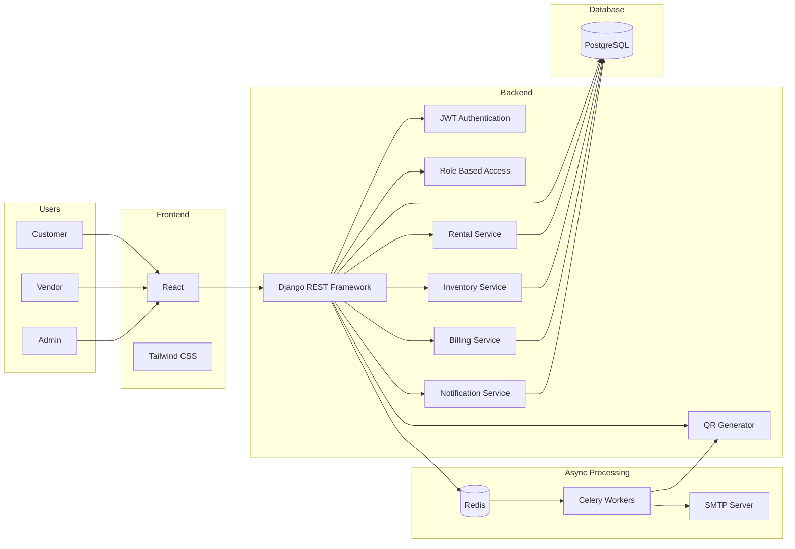
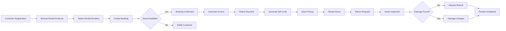
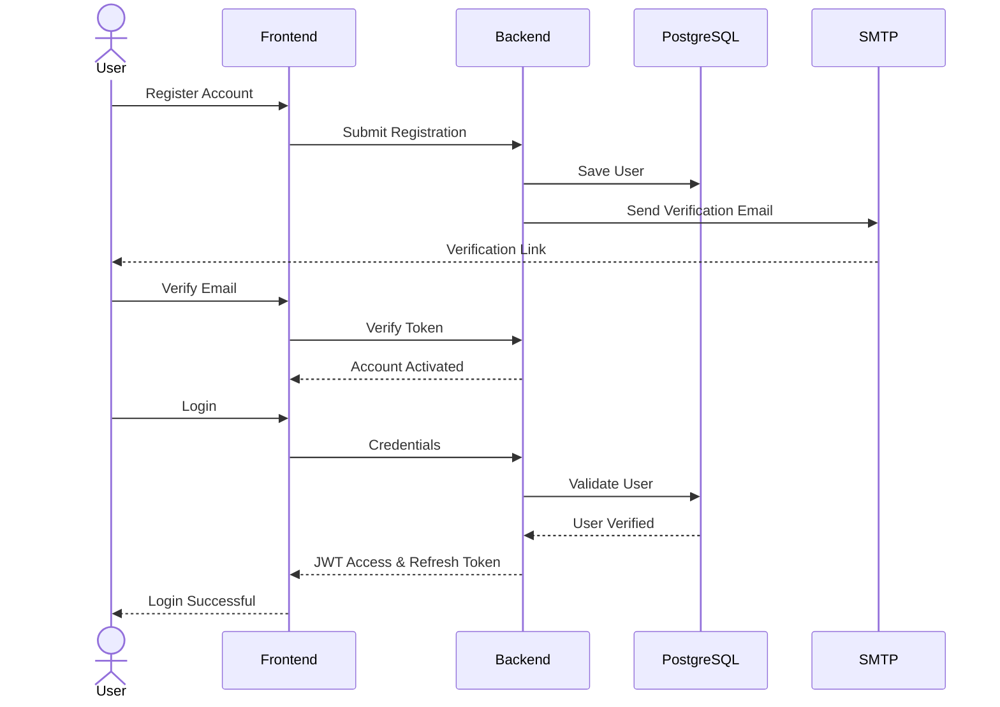
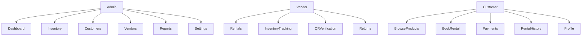
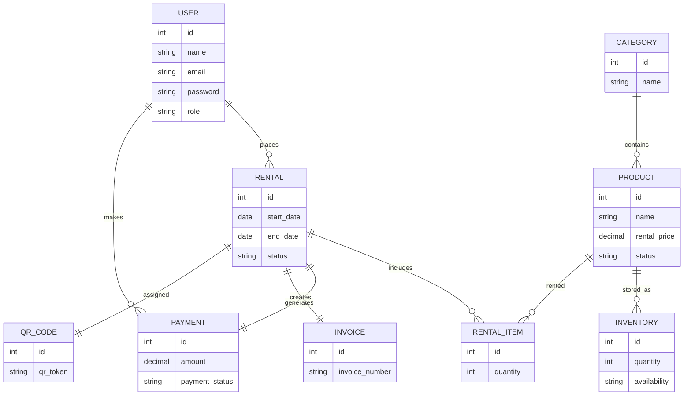
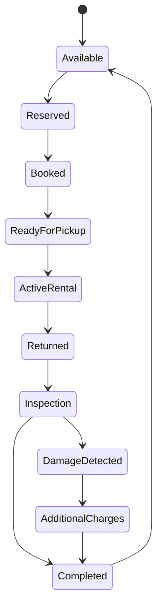
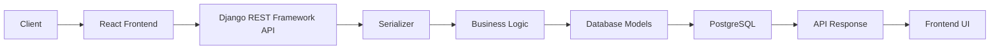
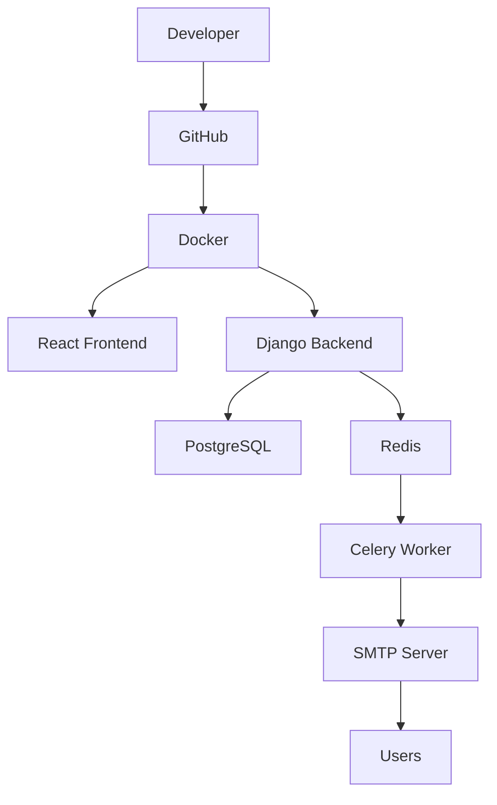

<p align="center">
  
</p>

<h1 align="center">Rental Hub</h1>

<p align="center">
A Modern ERP Platform for Smart Rental Business Management
</p>

<p align="center">
Rent Anything. Anytime. Anywhere.
</p>

<p align="center">


</p>

---

# 🚀 Rental Hub

Rental Hub is an enterprise-grade Rental ERP platform designed to simplify the complete rental lifecycle for businesses dealing with equipment, furniture, electronics, vehicles, tools, cameras, and other rentable assets.

Instead of managing rentals through spreadsheets, phone calls, and paperwork, Rental Hub centralizes inventory, bookings, payments, invoices, customer management, and returns into one intelligent platform.

Built using a modern full-stack architecture with React, Django REST Framework, PostgreSQL, Redis, Celery, Docker, and JWT Authentication.

---

# 🌟 Project Highlights

- Multi-category Rental Management
- Smart Inventory Tracking
- QR Code Based Asset Verification
- Online Booking System
- Customer & Vendor Management
- Secure Authentication
- Email Verification & Password Recovery
- Automated Invoice Generation
- Rental Analytics Dashboard
- Background Task Processing
- Dockerized Deployment

---

# 📚 Table of Contents

- Overview
- Problem Statement
- Solution
- Features
- Technology Stack
- System Architecture
- Rental Workflow
- Authentication
- User Roles
- Database Design
- Folder Structure
- Installation
- Screenshots
- Future Scope
- Team
- License

---

# 📖 Overview

Rental Hub provides a centralized platform where businesses can efficiently manage rental operations from customer registration to inventory allocation, payments, returns, inspections, and analytics.

The platform minimizes manual work, prevents inventory conflicts, improves operational efficiency, and enhances customer experience through automation and real-time tracking.

---

# 🎯 Problem Statement

Traditional rental businesses often face several operational challenges:

- Manual inventory management
- Double bookings
- Lack of real-time asset availability
- Paper-based rental agreements
- Delayed return tracking
- Manual invoice generation
- Poor customer communication
- Inefficient payment tracking
- Difficult asset monitoring
- Limited business insights

These issues result in operational delays, revenue loss, and poor customer experience.

---

# 💡 Solution

Rental Hub digitizes the complete rental lifecycle by integrating inventory management, customer onboarding, bookings, QR verification, billing, notifications, analytics, and secure authentication into one scalable ERP platform.

The system ensures transparency, automation, and real-time monitoring while reducing human errors and administrative overhead.

---

# ✨ Key Features

## 🏠 Rental Management

- Browse rental products
- Smart booking system
- Rental scheduling
- Booking history
- Rental status tracking

---

## 📦 Inventory Management

- Product catalog
- Category management
- Availability tracking
- Asset allocation
- Stock monitoring

---

## 👥 Customer Management

- Customer registration
- Profile management
- Rental history
- Address management
- Verification system

---

## 🔐 Authentication

- JWT Authentication
- Secure Login
- Email Verification
- Forgot Password
- Password Reset
- Protected APIs

---

## 💳 Billing & Payments

- Invoice generation
- Rental billing
- Deposit tracking
- Payment records
- Downloadable invoices

---

## 📱 QR Verification

- QR code generation
- Asset verification
- Rental validation
- Return verification

---

## 📧 Notifications

- Email Verification
- Booking Confirmation
- Return Reminder
- Invoice Notification
- Password Reset Email

---

## 📊 Analytics Dashboard

- Active Rentals
- Revenue Overview
- Inventory Insights
- Customer Statistics
- Rental Trends

---

# 🛠 Technology Stack

| Layer | Technologies |
|--------|--------------|
| Frontend | React, TypeScript, Tailwind CSS |
| Backend | Django, Django REST Framework |
| Database | PostgreSQL |
| Authentication | JWT Authentication |
| Background Jobs | Celery |
| Cache & Queue | Redis |
| Email Service | SMTP |
| QR Services | QR Code Generator |
| Containerization | Docker |
| Version Control | Git & GitHub |

---

# 🏗 Enterprise System Architecture



---

### 🏛 Architecture Overview

The platform follows a modular service-oriented architecture where the React frontend communicates with Django REST APIs secured by JWT authentication. Core business modules handle rentals, inventory, billing, notifications, and QR verification. PostgreSQL serves as the primary database, while Redis and Celery process asynchronous tasks such as email notifications and background jobs. Docker ensures consistent development and deployment environments.

---
# 🔄 Rental Lifecycle Workflow



---

# 🔐 Authentication Flow



---

# 👥 User Roles



---

## 🧑‍💼 Admin

- Dashboard Management
- Product Management
- Inventory Control
- Customer Management
- Employee Management
- Analytics & Reports
- Rental Monitoring

---

## 👨‍💻 Employee

- Process Rentals
- Verify QR Codes
- Handle Returns
- Inventory Updates
- Customer Assistance

---

## 👤 Customer

- Browse Products
- Book Rentals
- Make Payments
- Track Rentals
- Download Invoices
- Manage Profile

---

# 🗄 Database Design



---

# 📂 Project Structure

```
rental-hub/

│

├── frontend/
│   ├── public/
│   ├── src/
│   │   ├── assets/
│   │   ├── components/
│   │   ├── layouts/
│   │   ├── pages/
│   │   ├── services/
│   │   ├── hooks/
│   │   ├── context/
│   │   └── utils/
│
├── backend/
│   ├── accounts/
│   ├── rentals/
│   ├── inventory/
│   ├── payments/
│   ├── notifications/
│   ├── api/
│   ├── serializers/
│   ├── models/
│   └── settings/
│
├── docs/
│   ├── images/
│   └── screenshots/
│
├── docker/
│
├── docker-compose.yml
│
├── README.md
│
└── LICENSE
```

---

# 🚀 Installation

## Clone Repository

```bash
git clone https://github.com/nirmitrathod74/rental-hub.git
```

```bash
cd rental-hub
```

---

## Start Docker Containers

```bash
docker compose up --build
```

---

## Access Application

| Service | URL |
|----------|-----|
| Frontend | http://localhost:5173 |
| Backend API | http://localhost:8000 |
| Admin Panel | http://localhost:8000/admin |

---

# 🔁 Rental State Flow



---

# 🔌 API Request Flow



---

### ⚙️ Backend Overview

Rental Hub follows a layered backend architecture where requests are validated using Django REST Framework serializers before being processed by the business logic. The application interacts with PostgreSQL for persistent storage while Redis and Celery handle asynchronous operations such as email notifications and scheduled tasks. This separation of concerns improves maintainability, scalability, and overall system performance.

---
# 🐳 Deployment Architecture



---

## 🚀 Deployment Overview

Rental Hub is fully containerized using **Docker**, ensuring a consistent development and deployment environment across all systems.

The deployment consists of:

- **React + TypeScript** frontend
- **Django REST Framework** backend
- **PostgreSQL** database
- **Redis** for caching and task queue
- **Celery** for asynchronous background jobs
- **SMTP** for email verification and notifications

This architecture provides scalability, maintainability, and easy onboarding for developers.

---

# 📸 Application Screenshots

> Replace the following placeholders with actual project screenshots before submission.

---

## 🏠 Landing Page


---

## 📊 Admin Dashboard


---

## 📦 Inventory Management


---

## 📅 Rental Booking


---

## 👥 Customer Management


---

## 📱 QR Verification


---

## 💳 Billing & Invoice


---

## 📈 Analytics Dashboard


---

# 📌 Core Modules

| Module | Description |
|---------|-------------|
| Authentication | Secure JWT login with email verification |
| Customer Management | Manage customer profiles and rental history |
| Inventory | Track products, categories, and availability |
| Rental Management | Create, update, and monitor rental bookings |
| QR Verification | QR-based asset validation |
| Payments | Rental billing and payment tracking |
| Invoice Management | Auto-generated invoices |
| Notifications | Email verification and rental reminders |
| Analytics | Business insights and rental statistics |

---

# 📈 Future Enhancements

- 📱 Mobile Application
- 💳 Payment Gateway Integration
- 🌍 Multi-language Support
- ☁️ Cloud Deployment
- 📍 GPS Tracking for Rental Assets
- 🤖 AI-Based Rental Recommendations
- 📊 Advanced Business Analytics
- 🔔 Real-Time Push Notifications
- 📅 Calendar Integration
- 📄 Digital Rental Agreement with E-Signature

---

# 🤝 Contributing

Contributions, suggestions, and improvements are welcome.

If you'd like to contribute:

1. Fork the repository
2. Create a new feature branch
3. Commit your changes
4. Push the branch
5. Open a Pull Request

---

# 📜 License

This project is licensed under the **MIT License**.

Feel free to use, modify, and distribute this project under the terms of the license.

---

# 👨‍💻 Team Minus

| Name | Role |
|------|------|
| **Ayan Shaikh** | Full Stack Developer |
| **Nirmit Rathod** | Full Stack Developer |
| **Bhavarth Dobariya** | Full Stack Developer |
| **Jatin Panchal** | Full Stack Developer |

---

# 🏆 Built For

**Odoo x KSV Hackathon 2026**

Rental Hub was developed as an enterprise-grade Rental ERP solution to simplify rental operations through automation, secure workflows, and modern full-stack technologies.

---

# ⭐ Repository

🔗 **GitHub Repository**

https://github.com/nirmitrathod74/rental-hub

---

# ❤️ Acknowledgements

Special thanks to:

- Odoo
- KSV University
- LDRP Institute of Technology & Research
- Open Source Community
- React
- Django
- PostgreSQL
- Docker

for providing the technologies and inspiration behind this project.

---

<div align="center">

## ⭐ If you found this project useful, consider giving it a Star!

**Made with ❤️ by Team Minus**

</div>